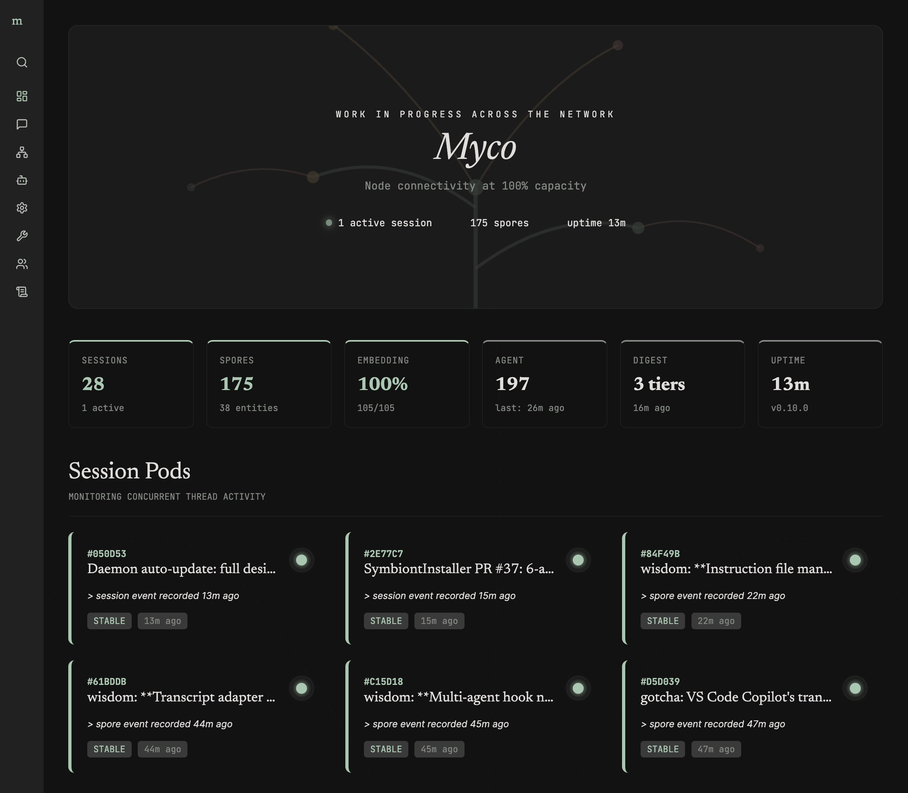

<p align="center">
  
</p>

<p align="center">
  <strong>The intelligence layer for your projects and team</strong>
</p>

<p align="center">
  <a href="https://github.com/goondocks-co/myco/actions/workflows/ci.yml"></a>
  <a href="https://github.com/goondocks-co/myco/actions/workflows/publish.yml"></a>
  <a href="https://www.npmjs.com/package/@goondocks/myco"></a>
  <a href="https://github.com/goondocks-co/myco/blob/main/LICENSE"></a>
  
  
</p>

```bash
curl -fsSL https://myco.sh/install.sh | sh
```

Then initialize in your project:
```bash
cd your-project
myco init
```

`myco init` detects your coding agents, installs hooks, starts the daemon, and opens the dashboard. Pick the agent and embedding providers from the Settings page when you're ready — data capture starts immediately, intelligence is opt-in. Works with Claude Code, Cursor, Codex, VS Code Copilot, Gemini CLI, Windsurf, and OpenCode.

## Upgrade path

Existing users still upgrade the main product the same way:

```bash
npm update -g @goondocks/myco
```

That remains the only package most users need. It updates the local CLI, daemon, hooks, dashboard, and the built-in `myco team init` / `myco team upgrade` flow.

If you also installed the optional standalone operator packages, the Operations page now detects and applies updates for those installed Myco packages too. You only need to drop to npm for the initial install.

Two new packages are optional operator surfaces:

- `@goondocks/myco-team` — direct team-worker administration from the terminal
- `@goondocks/myco-collective` — deploy and manage a Myco Collective

## What is Myco?

Myco is the intelligence layer beneath your projects. Named after [mycorrhizal networks](https://en.wikipedia.org/wiki/Mycorrhizal_network) — the underground fungal systems that connect trees in a forest — Myco captures what happens across your coding sessions and connects it into a living knowledge graph, sharing intelligence between agents and team members beneath the surface.

Every coding session produces knowledge: decisions made, gotchas discovered, trade-offs weighed, bugs fixed. Without Myco, that knowledge dies when the session ends. With Myco, it's captured as **spores** — discrete observations that persist, connect, and compound over time.

**For agents** — [MCP tools and skills](docs/agent-tools.md) let any agent search, recall, and build on accumulated knowledge. A digest extract is injected at session start and relevant spores surface after each prompt — agents get context without being told to search.

**For humans** — a local [dashboard](#dashboard) provides configuration, operational triggers, and monitoring. Manage providers, run intelligence cycles, and view live logs.

**For teams** — [team sync](docs/team-sync.md) shares accumulated knowledge across machines through a Cloudflare Worker. Every teammate's agent gets access to the team's collective intelligence — spores, session context, and the knowledge graph — through the same search tools they already use.

## How it works

### Capture

Myco hooks into your agent's lifecycle — session starts, prompts, tool calls, stops — and records activity in the vault's SQLite database. A background daemon parses the agent's conversation transcript to capture the full dialogue, including AI responses and any screenshots shared during the session.

### Intelligence

Myco runs an intelligence pipeline in the background that reads captured sessions and turns them into durable knowledge. It extracts **spores** (observations like decisions, gotchas, discoveries, trade-offs, bug fixes), generates session titles and summaries, links entities into a knowledge graph, and refreshes digest extracts — all automatically.

When the agent finds 3+ semantically similar spores, it synthesizes them into a **wisdom** spore — a higher-order observation that captures the pattern across sessions. Individual observations become institutional knowledge.

Every task can use a different LLM provider. Run title generation on a fast local model via Ollama, extraction on Claude, consolidation on a larger local model via LM Studio. Configure globally or per-task in `myco.yaml`, or use the [dashboard](#dashboard) to manage assignments visually.

See the [Intelligence Pipeline docs](docs/agent-harness.md) for the task catalog, provider configuration, and scheduling.

### Digest

The digest synthesizes accumulated knowledge into tiered **extracts** — pre-computed context at different depths:

| Tier | Purpose |
|------|---------|
| **1,500 tokens** | Executive briefing — what this project is, what's active, what to avoid |
| **5,000 tokens** | Deep onboarding — trade-offs, patterns, team dynamics |
| **10,000 tokens** | Institutional knowledge — full thread history and design tensions |

Extracts refresh in the background as new knowledge arrives. When the project goes quiet, refresh slows; new sessions wake it back up.

### Search

Every record is indexed for both keyword search and semantic similarity. Use [Ollama](https://ollama.com) locally for embeddings, or [OpenRouter](https://openrouter.ai) / [OpenAI](https://platform.openai.com) in the cloud. The index is fully rebuildable from the database.

### Context injection

Two automatic injection points ensure agents always have relevant intelligence:

- **Session start** — the digest extract gives the agent pre-computed project understanding before it asks a single question.
- **Per-prompt** — after each user prompt, relevant spores are retrieved via semantic search, providing targeted context for the task at hand.

Agents don't need to search explicitly — Myco surfaces what's relevant.

### Dashboard

A local web dashboard provides configuration and operations management. Manage intelligence providers and per-task model assignments, trigger agent and digest cycles, monitor daemon health, and view live logs.

<p align="center">
  
</p>

### Symbionts

Myco integrates with coding agents through **symbionts** — named for the mycorrhizal symbiotic relationship between fungi and their host trees. `myco init` detects available agents and lets you choose which to configure. Registration is project-local — hooks, MCP servers, skills, and auto-approve settings are written directly to each agent's config files.

| Agent | Hooks | MCP | Skills | Auto-Approve | Plans |
|-------|-------|-----|--------|-------------|-------|
| [Claude Code](https://claude.ai/code) | `.claude/settings.json` | `.mcp.json` | `.claude/skills/` | `permissions.allow` | `.claude/plans/` |
| [Cursor](https://cursor.com) | — | `.cursor/mcp.json` | `.cursor/skills/` | `autoApprove` | `.cursor/plans/` |
| [Codex](https://github.com/openai/codex) | `.codex/hooks.json` | `.codex/config.toml` | `.agents/skills/` | — | — |
| [VS Code Copilot](https://code.visualstudio.com/docs/copilot) | `.github/hooks/` | `.vscode/mcp.json` | `.agents/skills/` | `autoApprove` | — |
| [Gemini CLI](https://geminicli.com) | `.gemini/settings.json` | `.gemini/settings.json` | `.agents/skills/` | `coreTools` | `.gemini/plans/` |
| [Windsurf](https://windsurf.com) | `.windsurf/hooks.json` | — | `.agents/skills/` | `cascadeCommandsAllowList` | `~/.windsurf/plans/` |
| [OpenCode](https://opencode.ai) | `.opencode/plugins/myco.ts` (plugin) | `opencode.json` (`mcp` key) | `.agents/skills/` | `permission.bash` | `.opencode/plans/` |

Skills are installed once to `.agents/skills/` (the emerging cross-agent standard) and symlinked to each agent's native skills directory. Adding a new agent requires only a YAML manifest and templates — no code changes for JSON-hook agents, and a small manifest extension for plugin-based agents like OpenCode.

See the [Symbiont docs](docs/symbionts.md) for detailed setup information per agent.

### Team sync

Share knowledge across machines and team members with one command:

```bash
myco team init    # Provisions Cloudflare D1 + Vectorize + KV + Worker
```

Share the output URL and API key with teammates — they connect from the Team page in the dashboard. Once connected, knowledge syncs automatically: new spores, session summaries, plans, and graph edges push to the team store in the background. Search queries fan out to both local and cloud databases, merging results by relevance score.

Local databases remain the source of truth. The cloud store is a queryable mirror — no data is pulled back down. Each record carries a machine identity for attribution.

Runs on the Cloudflare free tier. See the [Team Sync docs](docs/team-sync.md) for the full guide.

### Collective

Search across projects and manage shared settings by connecting multiple team workers to one Myco Collective.

Install it only if you want the cross-project admin layer:

```bash
npm install -g @goondocks/myco-collective
myco-collective install
```

The Collective gives you a worker-hosted admin UI for connected projects, shared settings, and cross-project search. See the [Collective guide](docs/collective.md).

### Cloud MCP Server

Team sync also deploys a read-only **Cloud MCP server** on the same Worker — a Streamable HTTP endpoint that exposes your project's intelligence to cloud agents like Anthropic Managed Agents, OpenAI Workflows, and N8N. Connect any tool that speaks MCP and it gets the same project context your local agents already have. See the [Cloud MCP docs](docs/cloud-mcp.md) for the tool reference and setup.

### Skills — automated curation, not just memory

Memory is table stakes. Myco goes further: it turns everything your team learns into **repeatable workflows** that every agent follows. The intelligence pipeline identifies procedural patterns across sessions — debugging the build, adding API routes, configuring providers, resolving common gotchas — and surfaces them as candidates. You approve what becomes canon, and Myco generates validated SKILL.md files under `.agents/skills/`, symlinked into every agent's native skills directory.

Skills evolve as your code does. When a pattern is abandoned, a new gotcha is discovered, or a workflow shifts, the evolve task rewrites affected skills — preserving what's still accurate, incorporating what's new, and splitting skills that have grown too broad. See the [Skills docs](docs/skills.md) for the full lifecycle.

### Backup & restore

Local SQL dump backups run automatically during daemon idle periods. Configure a custom backup directory (network share, git repo) from the Operations page. Restore with content-hash deduplication — never overwrites existing records.

## Health check

```bash
myco doctor
```

Verifies vault config, database, intelligence provider, embedding provider, symbiont registration, and daemon status. Use `--fix` to auto-repair fixable issues.

## Contributing

Contributions welcome. See the [Contributing Guide](CONTRIBUTING.md) for development setup, and the [Lifecycle docs](docs/lifecycle.md) for architecture details. Please open an issue to discuss before submitting a PR.

## License

MIT
