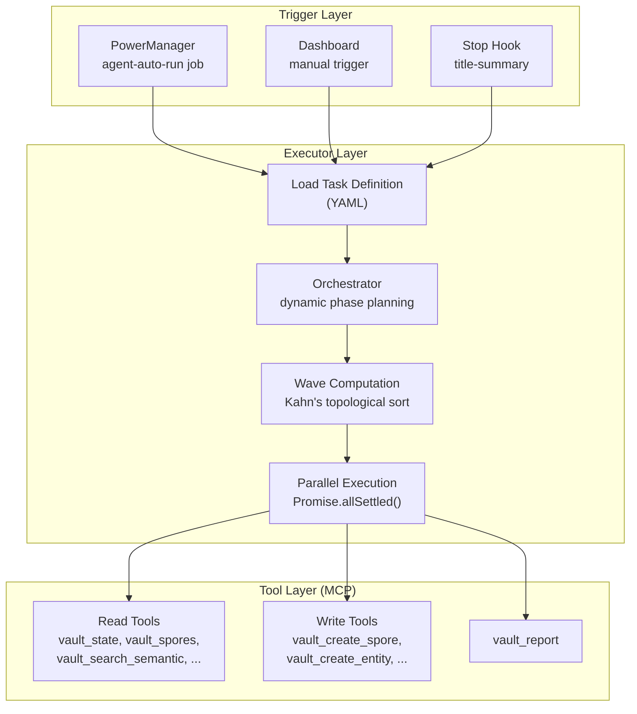
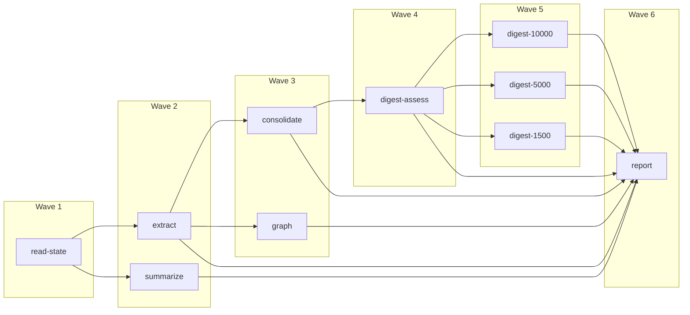
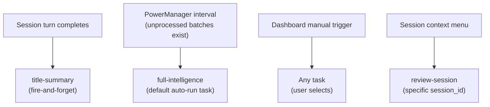
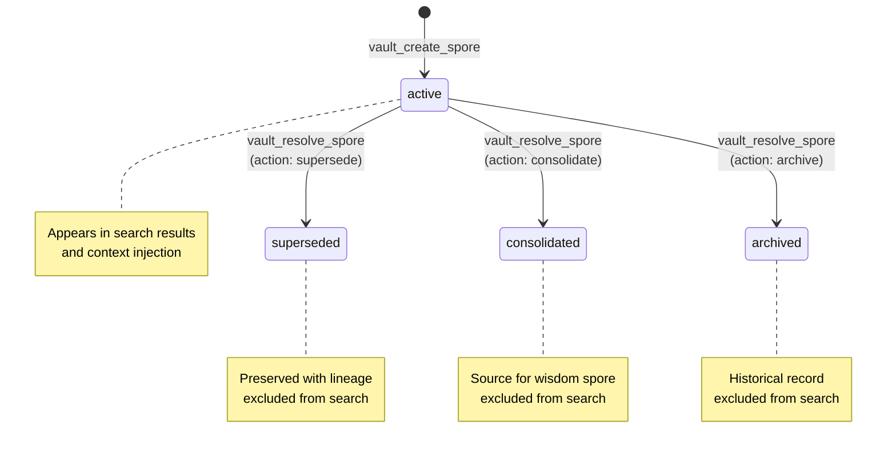
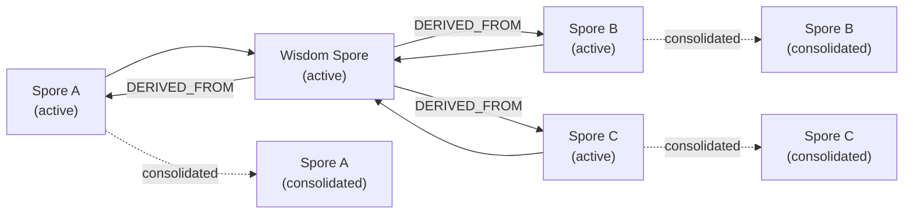
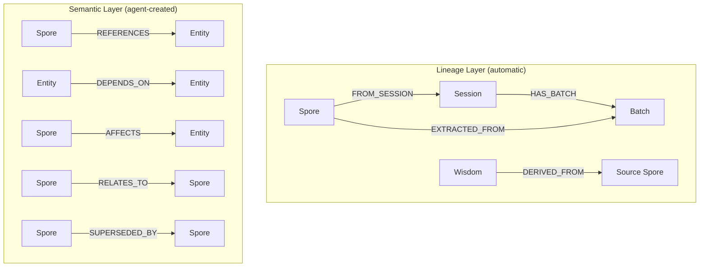
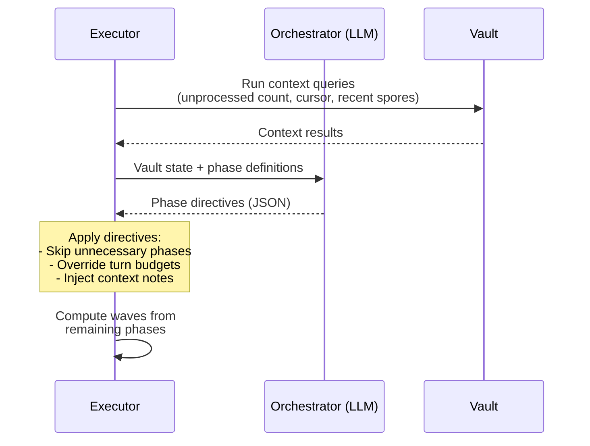
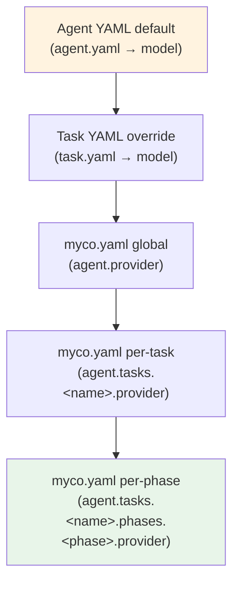
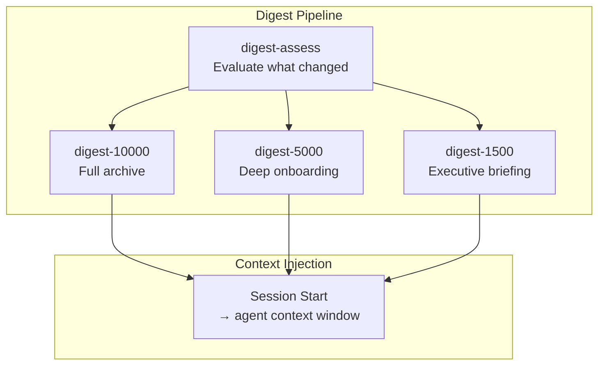
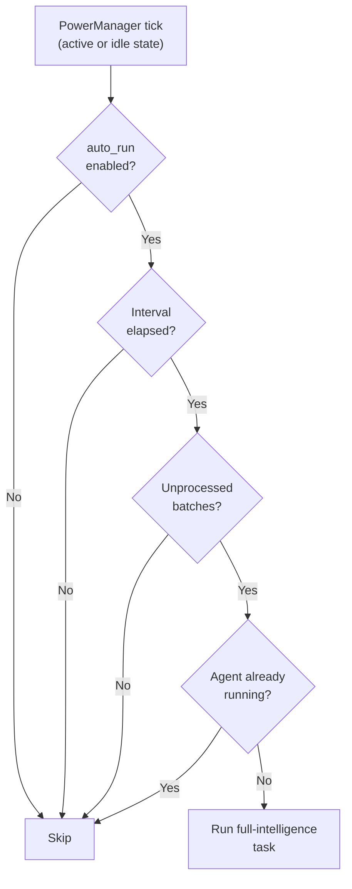

# Agent System

Myco's intelligence agent is a multi-phase reasoning pipeline that runs in the background, processing captured session data into institutional knowledge. It extracts observations, builds a knowledge graph, consolidates patterns into wisdom, and synthesizes digest context — all automatically.

## Architecture

The agent system has three layers: **trigger**, **executor**, and **tools**.



**Trigger layer** — The daemon's PowerManager runs the agent on a configurable interval when unprocessed batches exist. The dashboard provides manual triggers. The stop hook fires a lightweight `title-summary` task after each session turn.

**Executor layer** — Loads a task definition (YAML), optionally consults the orchestrator to skip unnecessary phases, then computes execution waves from the phase dependency graph using Kahn's algorithm. Phases within a wave run in parallel.

**Tool layer** — Each phase gets a scoped MCP tool server with only the tools listed in its definition. The agent cannot call tools outside its assigned set.

## Wave Execution Model

Phases declare dependencies on other phases. The executor builds a DAG and sorts phases into **waves** — groups that can execute in parallel because their dependencies are satisfied.



Each phase runs as an isolated SDK `query()` call with:

| Constraint | Mechanism |
|-----------|-----------|
| **Scoped tools** | Only tools declared in `phase.tools[]` are available |
| **Turn budget** | `phase.maxTurns` caps the number of LLM turns |
| **Provider isolation** | SDK `env` option passes credentials without mutating `process.env` |
| **Prior context** | Previous phase summaries injected into the prompt (opt-out with `skipPriorContext: true`) |
| **Deterministic session ID** | SHA256 of `runId + phaseName` — idempotent across retries |

If a **required** phase fails, the pipeline stops. If an **optional** phase fails, the pipeline continues — remaining phases execute without that phase's output.

## The Intelligence Pipeline

The default `full-intelligence` task is the complete pipeline. Here's what each phase does.

### Wave 1: Read State

```
Phase: read-state (required, 6 turns)
Tools: vault_state, vault_unprocessed, vault_spores, vault_report
```

Reads the cursor position (`last_processed_batch_id`) and checks for unprocessed batches. If nothing is pending, the pipeline short-circuits with a skip report.

### Wave 2: Extract + Summarize

Two independent phases run in parallel.

```
Phase: extract (required, 35 turns)
Tools: vault_unprocessed, vault_spores, vault_search_fts, vault_search_semantic,
       vault_create_spore, vault_resolve_spore, vault_mark_processed,
       vault_set_state, vault_report
```

The heaviest phase. Reads unprocessed batches, groups candidate observations by topic, searches for existing coverage, and creates or supersedes spores. The agent follows a strict protocol: **search before creating** to keep the vault sharp rather than bloated. After processing, it marks batches as processed and advances the cursor.

```
Phase: summarize (optional, 10 turns)
Tools: vault_sessions, vault_unprocessed, vault_spores,
       vault_update_session, vault_report
```

Generates or updates titles and summaries for sessions that received new batches. Titles describe what was accomplished (not what was asked), and summaries are detail-rich for semantic search embedding.

### Wave 3: Consolidate + Graph

Two independent phases run in parallel.

```
Phase: consolidate (optional, 22 turns)
Tools: vault_spores, vault_search_semantic, vault_create_spore,
       vault_resolve_spore, vault_report
```

Searches for clusters of related spores. When 3+ active spores cover the same topic, it synthesizes them into a **wisdom** spore — a higher-order observation that preserves all specific details from the sources. Source spores are resolved with action `consolidate`, removing them from search results while preserving them in the database with lineage metadata.

For pairs of redundant spores, it keeps the better one and supersedes the weaker.

```
Phase: graph (optional, 25 turns)
Tools: vault_spores, vault_sessions, vault_search_semantic, vault_entities,
       vault_edges, vault_create_entity, vault_create_edge, vault_report
```

Builds the semantic layer of the knowledge graph. Creates entities for components, concepts, and people that appear across multiple spores, then links spores to entities via `REFERENCES` edges and entities to each other via `DEPENDS_ON` and `AFFECTS` edges. Always checks for existing entities and edges before creating to prevent duplicates.

### Wave 4: Digest Assess

```
Phase: digest-assess (required, 8 turns)
Tools: vault_spores, vault_sessions, vault_search_semantic,
       vault_read_digest, vault_report
```

Evaluates what changed during extraction and consolidation, then produces detailed findings for the three parallel tier writers. This phase decides per-tier whether to UPDATE or SKIP based on the volume of new material and each tier's freshness. Its output is the primary input for the digest tiers — they cannot call search tools themselves.

### Wave 5: Digest Tiers (3 parallel)

Three independent phases run in parallel, each writing one digest tier.

```
Phase: digest-10000 (optional, 7 turns)  — Full institutional knowledge
Phase: digest-5000  (optional, 5 turns)  — Deep onboarding
Phase: digest-1500  (optional, 3 turns)  — Executive briefing
Tools: vault_search_semantic, vault_read_digest, vault_write_digest, vault_report
```

Each tier reads its current content, integrates new material from the assess phase, and writes the updated digest. The tiers form a compression hierarchy — each is roughly 3x smaller than the one above, applying increasing selectivity:

| Tier | Budget | Content |
|------|--------|---------|
| **10,000** | ~10,000 tokens | Complete archive — full thread history, design tensions, lessons learned |
| **5,000** | ~5,000 tokens | Deep onboarding — trade-offs, patterns, architectural decisions |
| **1,500** | ~1,500 tokens | Executive briefing — critical gotchas, blockers, and open issues only |

### Wave 6: Report

```
Phase: report (required, 3 turns)
Tools: vault_report
```

Produces a final summary: batches processed, spores created (by type), sessions updated, wisdom created, entities and edges created, digest tiers written. This phase receives prior phase summaries so it can accurately tally what each phase accomplished.

## Built-in Tasks

Seven tasks cover the full lifecycle, from lightweight title generation to the complete intelligence pipeline.

| Task | Type | Turns | Timeout | Purpose |
|------|------|-------|---------|---------|
| **full-intelligence** | Phased (10 phases, 6 waves) | 130 | 30 min | Complete pipeline — extract, consolidate, graph, digest |
| **title-summary** | Single query | 15 | 2 min | Generate/update session titles and summaries |
| **extract-only** | Single query | 30 | 5 min | Extract spores + update summaries, no graph or digest |
| **review-session** | Single query | 40 | 8 min | End-to-end processing of a single session |
| **graph-maintenance** | Single query | 40 | 8 min | Entity creation, edge linking, deduplication |
| **digest-only** | Single query | 28 | 30 min | Regenerate all digest tiers from current vault state |
| **supersession-sweep** | Single query | 30 | 5 min | Find and resolve duplicate/contradictory spores |

**Phased tasks** use the wave executor with parallel execution, scoped tools, and dependency-based ordering. **Single query tasks** run as one SDK `query()` call with the full tool set.

### When each task runs



## Tool System

The agent operates through 18 MCP tools, grouped by function.

### Read tools

| Tool | Purpose |
|------|---------|
| `vault_state` | Key-value store for cursor position and preferences |
| `vault_unprocessed` | Prompt batches not yet processed, with cursor pagination |
| `vault_spores` | List spores with filters: type, status, agent, session |
| `vault_sessions` | List sessions with optional status filter |
| `vault_search_fts` | Full-text keyword search (FTS5) across batches and activities |
| `vault_search_semantic` | Vector similarity search across spores, sessions, plans, and artifacts |
| `vault_entities` | List knowledge graph entities with type/name filters |
| `vault_edges` | List graph edges with source/target/type filters |
| `vault_read_digest` | Read digest metadata or a specific tier's content |

### Write tools

| Tool | Purpose |
|------|---------|
| `vault_create_spore` | Create a new observation with type, content, importance, tags |
| `vault_resolve_spore` | Resolve lifecycle: supersede, archive, consolidate |
| `vault_create_entity` | Create/upsert a knowledge graph node (component, concept, person) |
| `vault_create_edge` | Create a directed relationship between nodes |
| `vault_update_session` | Set a session's title and/or summary |
| `vault_mark_processed` | Mark a batch as processed (removes from `vault_unprocessed`) |
| `vault_set_state` | Store a key-value pair (cursor, preferences) |
| `vault_write_digest` | Write a digest extract at a given token tier |

### Observability

| Tool | Purpose |
|------|---------|
| `vault_report` | Record a structured report for the current run |

### Scoped tool servers

For phased tasks, the executor creates a **scoped MCP server** per phase that filters the full tool set down to only the tools listed in `phase.tools[]`. This prevents a phase from accidentally (or intentionally) calling tools outside its responsibility — extract phases can't write digests, digest phases can't create spores.

## Spore Lifecycle

Spores are the fundamental unit of knowledge in Myco. Each spore is a discrete observation extracted from session data.

### Observation types

| Type | What it captures |
|------|-----------------|
| **gotcha** | Surprising behavior or hidden pitfall that would save time if known in advance |
| **decision** | Architectural or implementation choice with rationale |
| **discovery** | New understanding about the codebase, a tool, or an approach |
| **trade_off** | Deliberate compromise with pros and cons weighed |
| **bug_fix** | Bug found and fixed, including root cause |
| **wisdom** | Higher-order synthesis from 3+ related spores (created during consolidation) |

### Status transitions



Only **active** spores appear in search results and context injection. Resolved spores remain in the database with full provenance but are excluded from agent context.

### Consolidation flow



When 3+ semantically similar spores are found, the agent:
1. Creates a wisdom spore with `properties.consolidated_from` listing source IDs
2. `DERIVED_FROM` edges are auto-created from wisdom to each source
3. Each source is resolved with action `consolidate`
4. The wisdom spore preserves **all** specific details from sources — file paths, error messages, concrete values

## Knowledge Graph

The graph uses a two-layer model stored in the `graph_edges` table.



**Lineage layer** — Created automatically by the daemon on insert. Traces provenance: which session, which batch, which source spores. Never created by the agent.

**Semantic layer** — Created by the agent during the graph phase. Captures meaning: what references what, what depends on what, what affects what.

### Entity types

| Type | What it represents | Example |
|------|-------------------|---------|
| **component** | Module, class, service, or significant function | `DaemonClient`, `SQLite`, `EventBuffer` |
| **concept** | Architectural pattern or domain concept spanning 2+ sessions | `cursor-based pagination`, `idempotent writes` |
| **person** | Contributor or team member | `Chris` |

Entities are created only when referenced by 3+ spores from 2+ different sessions. They are hubs in the graph, not labels for every concept mentioned.

### Edge types

| Edge | Direction | Meaning |
|------|-----------|---------|
| `REFERENCES` | spore → entity | Spore discusses this entity |
| `DEPENDS_ON` | entity → entity | Architectural dependency |
| `AFFECTS` | spore → entity | Observation impacts this component |
| `RELATES_TO` | any → any | General semantic relationship |
| `SUPERSEDED_BY` | spore → spore | Newer observation replaces older |

## Orchestrator

The orchestrator is an optional pre-planning step that runs before wave execution. When enabled, it analyzes the vault state and decides which phases to skip and what context to inject.



The orchestrator produces a JSON plan with per-phase directives:
- **skip** — Remove this phase from execution (only optional phases)
- **maxTurns** — Override the phase's turn budget
- **contextNotes** — Inject guidance into the phase prompt under "## Orchestrator Guidance"

This prevents wasted computation — if the vault has no consolidation candidates, the orchestrator can skip the consolidate and digest phases entirely.

## Provider Configuration

Every task and phase can use a different LLM provider. The resolution follows a strict precedence hierarchy:



Higher in the diagram = lower priority. The per-phase config in `myco.yaml` wins over everything.

### Example configuration

```yaml
agent:
  auto_run: true
  interval_seconds: 300
  provider:                          # Global default
    type: cloud
    model: claude-sonnet-4-6
  tasks:
    title-summary:
      provider:                      # Fast local model for titles
        type: ollama
        model: granite4:small-h
        context_length: 32768
    full-intelligence:
      phases:
        extract:
          provider:                  # Cloud for extraction quality
            type: cloud
            model: claude-sonnet-4-6
        consolidate:
          provider:                  # Local for cost savings
            type: ollama
            model: llama3.2
```

### Supported providers

| Provider | Type | Notes |
|----------|------|-------|
| **Cloud** (Anthropic) | `cloud` | Claude models via Anthropic API |
| **Ollama** | `ollama` | Local models, auto-creates context-aware variants |
| **LM Studio** | `lmstudio` | Local models via OpenAI-compatible API |
| **OpenRouter** | `openrouter` | Cloud model gateway |
| **OpenAI-compatible** | `openai-compatible` | Any OpenAI-compatible endpoint |

For Ollama, the executor automatically creates Modelfile variants with the correct `num_ctx` parameter baked in, since per-request context window overrides are unreliable when a model is already loaded.

## Digest System

The digest synthesizes accumulated knowledge into tiered extracts — pre-computed context served instantly at session start.



The three tiers serve different use cases:

| Tier | Compression | Use case |
|------|-------------|----------|
| **10,000** | ~3x from raw | Long-context sessions that need full institutional knowledge |
| **5,000** | ~6x from raw | Standard sessions — trade-offs, patterns, decisions |
| **1,500** | ~20x from raw | Quick orientation — what is this, what's active, what to avoid |

The assess phase acts as a gatekeeper — if changes are minor (< 3 new spores, 0 entity changes), it skips all tier updates. Each tier integrates new material into its existing content rather than rewriting from scratch.

## Auto-Run Behavior

The agent runs automatically via the daemon's PowerManager when conditions are met:



The agent only runs in `active` and `idle` power states — never during `sleep` or `deep_sleep`. This prevents background intelligence work from running when the developer has stepped away.

## Configuration Reference

All agent configuration lives under the `agent:` key in `myco.yaml`:

```yaml
agent:
  # Auto-run settings
  auto_run: true                    # Enable automatic intelligence runs
  interval_seconds: 300             # Minimum seconds between auto-runs
  summary_batch_interval: 5         # Batches between title-summary triggers (0 = disable)

  # Default provider for all tasks
  provider:
    type: cloud                     # cloud | ollama | lmstudio | openrouter | openai-compatible
    model: claude-sonnet-4-6        # Model name
    base_url: http://...            # For local/custom endpoints
    context_length: 8192            # For local models

  # Per-task overrides
  tasks:
    <task-name>:
      provider: { ... }            # Override provider for this task
      maxTurns: N                  # Override turn budget
      timeoutSeconds: N            # Override timeout
      phases:
        <phase-name>:
          provider: { ... }        # Override provider for this phase
          maxTurns: N              # Override turn budget for this phase
```

### Task definitions

Built-in tasks are defined in `src/agent/definitions/tasks/*.yaml`. Custom tasks can be placed in `.myco/tasks/*.yaml` and are loaded at daemon startup alongside built-in definitions.

Each task YAML supports:

| Field | Required | Description |
|-------|----------|-------------|
| `name` | Yes | Unique identifier |
| `displayName` | Yes | Human-readable name |
| `description` | Yes | What the task does |
| `agent` | Yes | Agent definition to use |
| `prompt` | Yes | System instructions for the task |
| `isDefault` | No | Whether this is the default auto-run task |
| `model` | No | Default model override |
| `maxTurns` | No | Maximum LLM turns |
| `timeoutSeconds` | No | Execution timeout |
| `phases` | No | Phase definitions for phased execution |
| `orchestrator` | No | Orchestrator configuration |
| `contextQueries` | No | Pre-execution vault queries |
| `toolOverrides` | No | Tool subset for single-query tasks |
