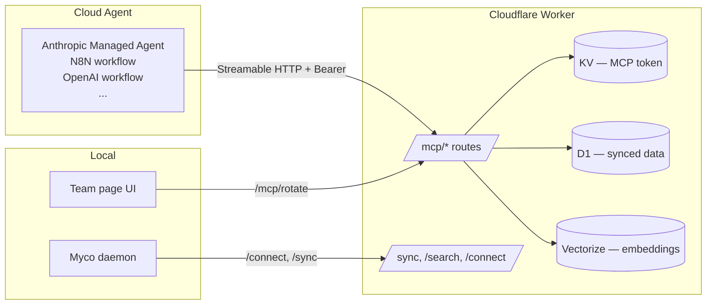

# Cloud MCP Server

Expose your project's accumulated intelligence to cloud agents — Anthropic Managed Agents, OpenAI Workflows, N8N, GitHub Copilot agents, and anything else that speaks [Model Context Protocol](https://modelcontextprotocol.io). Once [team sync](team-sync.md) is provisioned, the Cloud MCP Server is deployed automatically alongside it on the same Cloudflare Worker, serving a read-only view of your synced knowledge over Streamable HTTP.

## What you get

Cloud agents can query your project's intelligence with the same semantic fidelity that local agents already have — digest extracts, searchable spores, session history, the knowledge graph, and generated skills. Every tool is backed by the team's Cloudflare D1 database and Vectorize index, so results stay fresh as your team syncs.



## How it's different from the local MCP server

Myco already exposes [12 tools over MCP to your local agents](agent-tools.md). Those run in-process through the daemon and can write to your local database. The Cloud MCP Server is deliberately distinct:

| | Local MCP server | Cloud MCP server |
|---|---|---|
| Transport | stdio | Streamable HTTP |
| Host | Myco daemon | Cloudflare Worker |
| Data source | Local SQLite | Cloudflare D1 + Vectorize |
| Auth | None (local) | Bearer token |
| Tools | 12 (read + write) | 7 (read-only) |
| Use case | Your dev agent, Claude Code, etc. | Cloud agents that never touch your machine |

The two surfaces are independent and the tool names are different by design — a cloud agent isn't a drop-in replacement for your local agent, so the tools are reshaped for cloud use cases rather than mirrored.

## Tool surface

Seven read-only tools, organized into three tiers.

### Discovery — start here

**`myco_search`** — Semantic and keyword search across all project knowledge. Returns ranked results with content previews.
- `query` (string, required) — natural-language search
- `types` (string array, optional) — filter to specific content kinds: `spores`, `sessions`, `plans`, `artifacts`
- `limit` (number, default 10, max 50) — maximum results

**`myco_context`** — Pre-synthesized project digest at three depth tiers. The fastest way for a cloud agent to understand the project.
- `tier` (number, optional) — `1500` (executive summary), `5000` (deep onboarding, default), `10000` (comprehensive institutional knowledge)

### Detail — retrieve specific items

**`myco_get`** — Retrieve a full item by ID and type. Use after search to get complete details.
- `id` (string, required) — the item ID (from search results)
- `type` (enum, required) — `session`, `spore`, `plan`, `artifact`, `skill`

**`myco_sessions`** — List and filter coding sessions.
- `limit` (number, default 20, max 100)
- `status` (string, optional) — e.g. `active`, `completed`
- `agent` (string, optional) — e.g. `claude-code`, `cursor`, `codex`
- `branch` (string, optional) — filter by git branch
- `since` (ISO date string, optional) — only sessions started after this date

### Structure — understand relationships

**`myco_graph`** — Traverse the knowledge graph from an entity or note. Returns edges and connected entities with relationship types and confidence scores.
- `node_id` (string, required) — the entity or note to start from
- `direction` (enum, optional) — `incoming`, `outgoing`, `both` (default)

**`myco_skills`** — List project skills (reusable patterns extracted from knowledge).
- `status` (string, optional) — e.g. `active`, `draft`, `stale`, `retired`
- `limit` (number, default 50, max 100)

**`myco_team`** — List team nodes (machines/developers connected to this project) with sync status and package versions.

### What's not here

Write tools (`remember`, `supersede`, `approve candidate`) and the `consolidate` intelligence tool are deliberately excluded from v1. Cloud MCP is a read-only window — writes live in local MCP, where the daemon owns the data lifecycle. Write semantics for cloud agents are a future concern tied to agent-to-agent orchestration.

## Enabling it

**Nothing to do.** If you've run `myco team init` and the daemon is on a version that ships Cloud MCP, the Worker provisions the needed infrastructure (a Workers KV namespace for secrets storage) and deploys the Cloud MCP server as part of normal team sync provisioning. On the first `/connect` handshake, the Worker generates a per-project MCP bearer token and returns it to your daemon, which surfaces it in the Team page UI.

Existing team sync deployments are upgraded automatically the next time you click **Update Worker** in the Team page. The upgrade provisions a KV namespace if one doesn't exist, installs the new runtime dependencies, enables the `nodejs_compat` flag, and redeploys the Worker.

## Finding your endpoint

Open the Myco daemon UI → **Team** page. When team sync is connected, a **Cloud MCP Endpoint** section shows:

- The MCP endpoint URL (your worker URL plus `/mcp`)
- The MCP access token (redacted by default, click the eye to reveal, copy button on hover)
- A **Config snippet** button that expands a pre-formatted Anthropic Managed Agent configuration
- A **Rotate token** action (with destructive-action confirmation)

Every connected daemon node gets the same endpoint and token automatically — there's nothing to distribute manually across teammates.

## Connecting a cloud agent

### Anthropic Managed Agents

Use the Config snippet from the Team page, or paste this into your agent's `mcp_servers` definition:

```json
{
  "mcp_servers": [
    {
      "type": "url",
      "url": "https://<your-worker>.workers.dev/mcp",
      "name": "myco",
      "authorization_token": "<MCP_ACCESS_TOKEN>"
    }
  ]
}
```

Anthropic's agent infrastructure auto-detects Streamable HTTP and stores the authorization token in a vault outside the sandbox, so the token is never exposed to the agent's execution environment.

### N8N, Make, Zapier, and other automation platforms

Configure an MCP server connector with:

- **URL** — `https://<your-worker>.workers.dev/mcp`
- **Transport** — Streamable HTTP (most platforms auto-detect)
- **Header** — `Authorization: Bearer <MCP_ACCESS_TOKEN>`

### MCP Inspector (for debugging)

[MCP Inspector](https://github.com/modelcontextprotocol/inspector) is the fastest way to verify your server is working:

```bash
npx @modelcontextprotocol/inspector
```

In the Inspector:
1. Set **Transport Type** to `Streamable HTTP`
2. Set **URL** to your MCP endpoint (from the Team page)
3. Expand **Authentication** → add a custom header `Authorization` with value `Bearer <MCP_ACCESS_TOKEN>` and toggle it on
4. Click **Connect**

You should see `myco` v1.0.0 connected and all 7 tools listed. Click any tool, fill in its args, and click **Run Tool**.

## Authentication model

Two separate tokens, each with a distinct purpose:

| Concern | Key | Managed by | Scope |
|---|---|---|---|
| Node sync | `MYCO_TEAM_API_KEY` | Provisioner, shared manually with teammates | Machine → Worker (POST /sync) |
| MCP access | `MCP_ACCESS_TOKEN` | Worker, stored in Workers KV, distributed automatically to connected nodes | Cloud agent → Worker (`/mcp/*`) |

The MCP token is stored in **Cloudflare Workers KV** (encrypted at rest via AES-256-GCM), not in D1. This keeps it out of the structured database that agents query and makes it invisible to D1 exports or backups.

### Token distribution

1. **On first connect** after the Worker is deployed, the Worker checks KV for an existing MCP token. If absent, it generates one with `crypto.randomUUID()` and stores it in KV.
2. **Connect responses** include the full token — every daemon that connects hydrates its local copy automatically.
3. **Health responses** include only a short hash of the current token. Daemons compare the hash against their cached value and re-fetch the token via `/connect` when the hash changes — this is how rotations propagate.
4. **The daemon UI** reads the token from the local daemon's team status API and displays it in the Team page.

### Token rotation

From the Team page, click **Rotate token** on the Cloud MCP Endpoint section. A confirmation dialog makes the blast radius explicit — rotating invalidates the current token immediately, and every cloud agent currently using it will lose access until you reconfigure them with the new token.

The rotation flow:

1. Your daemon calls `POST /mcp/rotate` on the Worker (authenticated with `MYCO_TEAM_API_KEY`)
2. The Worker generates a new token, writes it to KV, and returns it
3. Your daemon caches the new token and the UI refreshes
4. Other connected daemons detect the hash change on their next health poll and re-fetch
5. The old token is immediately rejected by `/mcp/*` requests

## Worker endpoints

The Cloud MCP Server adds two routes to the existing team sync Worker:

| Method | Route | Auth | Purpose |
|--------|-------|------|---------|
| `*`    | `/mcp/*` | MCP token (Bearer) | Streamable HTTP MCP protocol surface |
| `POST` | `/mcp/rotate` | Team API key (Bearer) | Rotate the MCP access token |

All existing sync routes (`/connect`, `/sync`, `/search`, `/config`, `/health`) are unchanged, except `/connect` now additionally returns `mcp_token` and `mcp_endpoint`, and `/health` returns `mcp_token_hash` for change detection.

## Data freshness

Cloud MCP tools query Cloudflare D1 and Vectorize directly. The freshness of their results is the freshness of your team's outbox drain — as soon as a spore, session, or plan is synced from any teammate's daemon, it becomes queryable through the Cloud MCP server. There's no separate index to rebuild.

## A2A extensibility (future)

The Cloud MCP server is deliberately single-project-scoped. One bearer token authorizes access to one project's intelligence. A broader **agent-to-agent** layer — where a Slack agent could ask a Myco orchestrator "what are our product's capabilities across all projects?" — is planned as a separate layer that will sit above Cloud MCP and use multiple MCP endpoints under the hood.

The current design preserves this future direction:

- Tool results carry `machine_id` and `type` metadata so an orchestrator can attribute them to a source
- Auth lives behind a single `authenticateMcpRequest()` function, so OAuth or scoped A2A credentials can layer on without reworking the tool layer
- Read-only tools have no side effects, so write tools can be added later without reshaping the read surface
- The Worker is stateless, so adding more deployments or federation is a deployment concern, not an architectural one

## Cost

The Cloud MCP server shares the existing team sync Worker, so there's no additional Worker invocation cost beyond the tool calls themselves. Read traffic from cloud agents hits D1 (read queries), Vectorize (semantic search), and Workers AI (query embedding for `myco_search`). A small team running a handful of automated agents stays well within the Cloudflare free tier.

## Troubleshooting

**"401 Invalid MCP access token"** — The token in your cloud agent's config doesn't match what's in KV. Pull the current token from the Team page and update your agent. If the token was recently rotated, all configured agents need to be updated.

**"401 Missing Authorization header"** — Your cloud agent isn't sending the `Authorization: Bearer <token>` header. For MCP Inspector, make sure the custom header toggle is enabled.

**"Cloud MCP Endpoint section doesn't appear in the Team page"** — The daemon hasn't fetched the token yet. This happens when the Worker was upgraded after the daemon started. Restart the daemon, or wait ~10 seconds for the next health poll to detect the new token hash and trigger a re-connect.

**Worker deploy fails after upgrade with `nodejs_compat` errors** — The upgrade path enables this flag automatically. If you hand-edited `wrangler.toml` at any point, verify `compatibility_flags = [ "nodejs_compat" ]` is present.

**Worker deploy fails with missing `node_modules`** — `myco team upgrade` runs `npm install` in the deploy directory before `wrangler deploy`. If you're deploying manually, remember to install dependencies first.

For deeper debugging, check the daemon log at `.myco/logs/daemon.log` for `team-sync.upgrade.*` events — worker deployment errors are now captured with the full wrangler stderr.
