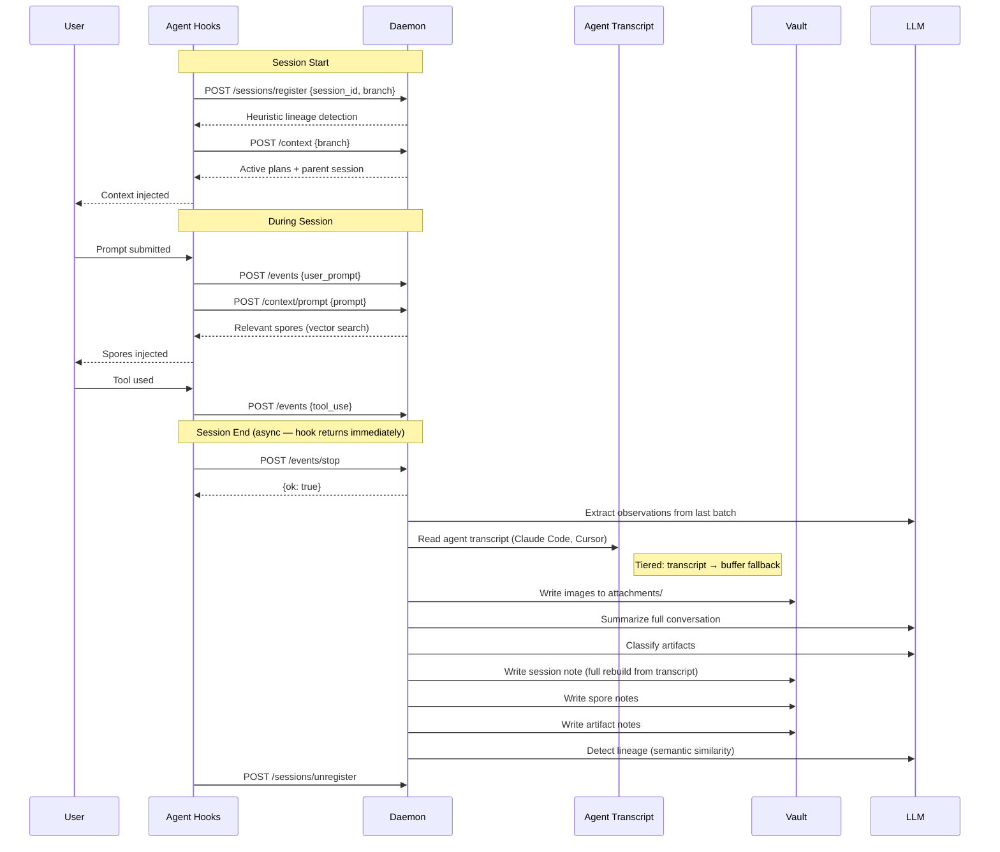
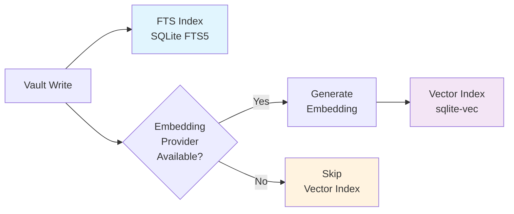
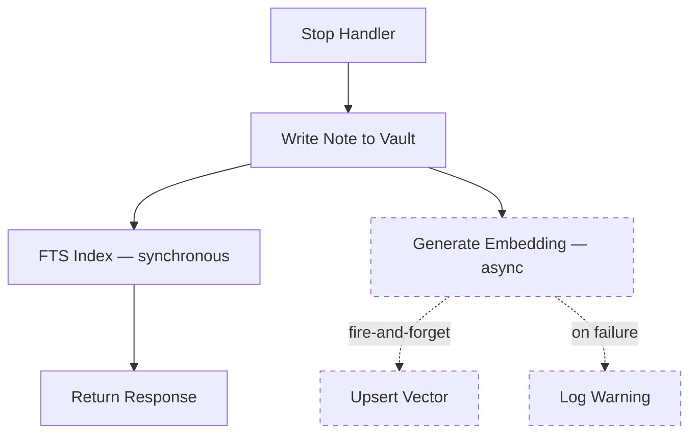
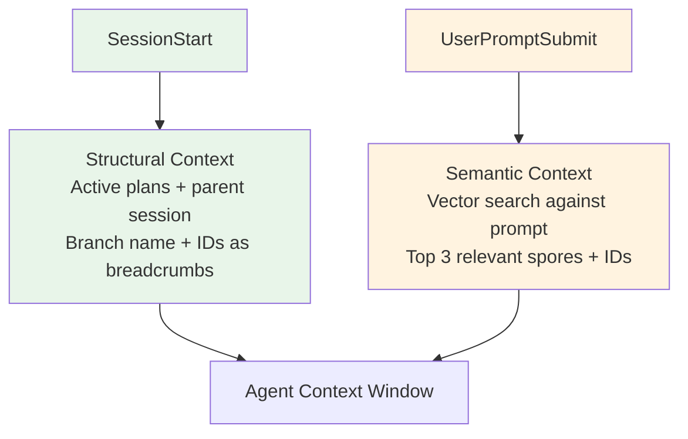
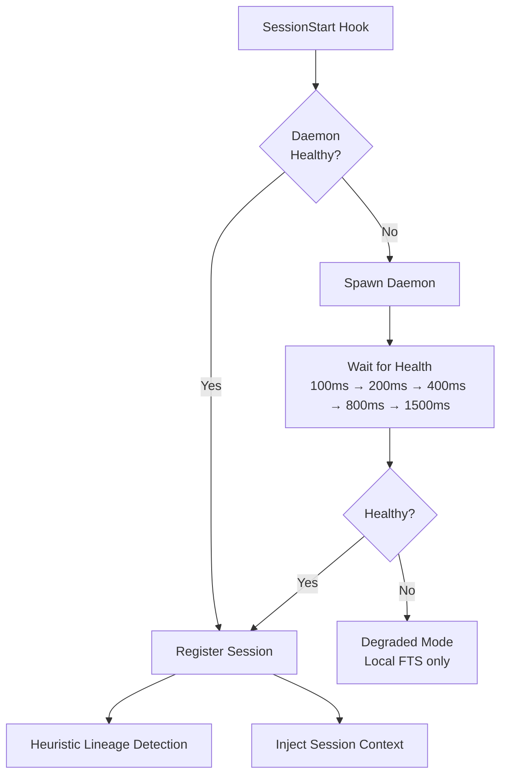
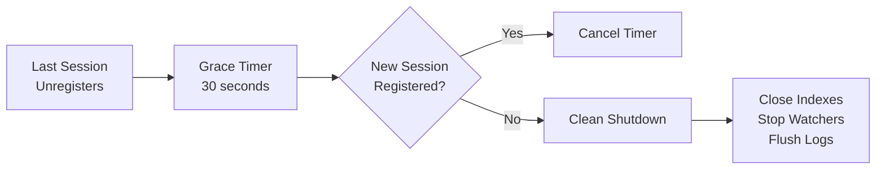

# Daemon Lifecycle

Myco runs a long-lived background daemon that processes session events, extracts observations, and maintains the vault index. The daemon is fully automatic — users never start, stop, or restart it manually.

## Session Flow



## Indexing & Embedding Pipeline

Every vault write goes through a two-stage indexing process: FTS for keyword search, vector embeddings for semantic search.



### What Gets Indexed and Embedded

| Content | When | FTS Indexed | Embedded | Vector ID |
|---------|------|-------------|----------|-----------|
| Session notes | Stop handler | ✅ `indexAndEmbed` | ✅ fire-and-forget | `session-{id}` |
| Observations (daemon) | Stop handler | ✅ `indexAndEmbed` | ✅ fire-and-forget | `{type}-{session}-{ts}` |
| Observations (MCP `myco_remember`) | On tool call | ✅ `indexNote` | ✅ `embedNote` | `{type}-{hex}` |
| Artifacts | Stop handler | ✅ `indexAndEmbed` | ✅ fire-and-forget | `{slugified-path}` |
| Plans (file watcher) | Real-time | ✅ `indexAndEmbed` | ✅ fire-and-forget | `plan-{filename}` |
| Wisdom notes (`myco_consolidate`) | On tool call | ✅ `indexNote` | ✅ `embedNote` | `{type}-wisdom-{hex}` |
| Superseded spores | On supersede | ✅ (updated) | ❌ (embedding deleted) | — |

### Embedding is Fire-and-Forget

Embeddings are generated asynchronously and never block the response. If the embedding provider is unavailable, the note is still written and FTS-indexed — semantic search just won't find it until the next `rebuild`.



## Context Injection

Two injection points, each with a different purpose:



**Session start** — injected once, structural framing:
- Active plans (what's in flight)
- Parent session summary (lineage continuity)
- Git branch name
- IDs as breadcrumbs for MCP tool follow-up

**Per-prompt** — injected on every prompt, targeted intelligence:
- Vector similarity search against the prompt text (~20ms, no LLM)
- Top 3 spores, filtered for superseded/archived
- Each result includes the spore ID for follow-up
- Short prompts (<10 chars) skip the search

## Daemon Startup



The daemon initializes in this order:

1. Load config from `myco.yaml`
2. Create structured logger
3. Initialize LLM provider + embedding provider
4. Initialize vector index (test embedding for dimensions)
5. Initialize FTS index
6. Initialize lineage graph
7. Migrate flat spore files to type subdirectories (if needed)
8. Start plan file watcher
9. Start HTTP server
10. Write `daemon.json` with PID and port

## Shutdown

The daemon shuts itself down after a grace period with no active sessions:



The grace period prevents the daemon from cycling on/off during rapid session reloads (e.g., clearing context → new session within seconds).

## Degraded Mode

If the daemon is unreachable, hooks fall back gracefully:

| Hook | Degraded behavior |
|------|-------------------|
| `SessionStart` | Context injection via local FTS query (no semantic search) |
| `UserPromptSubmit` | Events buffered to disk (JSONL files), no context injection |
| `PostToolUse` | Events buffered to disk |
| `Stop` | Local LLM processing: session/spore writes (no embeddings, no lineage) |
| `SessionEnd` | No-op |

Buffered events are processed by the daemon when it next starts. Buffer files are cleaned up after 24 hours.

## After Plugin Updates

1. Old daemon continues running with old code until it shuts down
2. Next `SessionStart` hook spawns a new daemon from the updated `dist/` directory
3. New daemon picks up seamlessly — same vault, same indexes, same config

No manual restart needed. For development, use `make build && node dist/src/cli.js restart`.

## Configuration

```yaml
daemon:
  log_level: info          # debug | info | warn | error
  grace_period: 30         # seconds before shutdown after last session ends
  max_log_size: 5242880    # log rotation threshold (bytes)
```

## Monitoring

```bash
node dist/src/cli.js stats    # PID, port, active sessions, vault stats
node dist/src/cli.js logs     # Tail daemon + MCP activity logs
```

Or via MCP:
```json
{ "tool": "myco_logs", "level": "info", "component": "lifecycle" }
```

## Files

| File | Purpose |
|------|---------|
| `daemon.json` | Running daemon PID and port |
| `index.db` | SQLite FTS5 full-text search index |
| `vectors.db` | sqlite-vec vector embedding index |
| `lineage.json` | Session parent-child relationship graph |
| `logs/daemon.log` | Daemon structured logs (JSONL) |
| `logs/mcp.jsonl` | MCP tool activity log |
| `buffer/*.jsonl` | Per-session event buffers (ephemeral) |
| `attachments/*.png` | Images extracted from session transcripts (Obsidian embeds) |

## Transcript Sourcing

Session conversation turns are built from the agent's native transcript file — not from Myco's event buffer. The buffer only captures what hooks send (user prompts, tool uses) and has no AI responses.

The agent adapter registry (`src/agents/`) tries each adapter in priority order:

| Agent | Transcript Location | Format |
|-------|-------------------|--------|
| Claude Code | `~/.claude/projects/<project>/<session>.jsonl` | JSONL (`type` field) |
| Cursor (newer) | `~/.cursor/projects/<project>/agent-transcripts/<session>/<session>.jsonl` | JSONL (`role` field) |
| Cursor (older) | `~/.cursor/projects/<project>/agent-transcripts/<session>.txt` | Plain text (`user:`/`assistant:` markers) |
| Buffer fallback | `buffer/<session>.jsonl` | Myco's own event buffer (no AI responses) |

Images in transcripts are decoded and saved to `attachments/` as `{session-id}-t{turn}-{index}.{ext}`, then embedded in the session note with `![[filename]]`.
