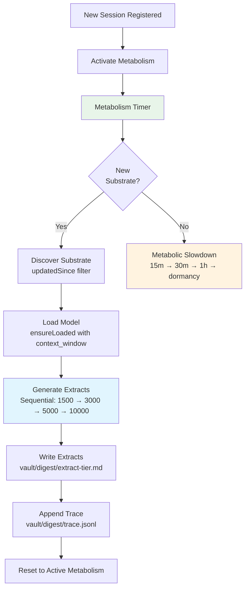
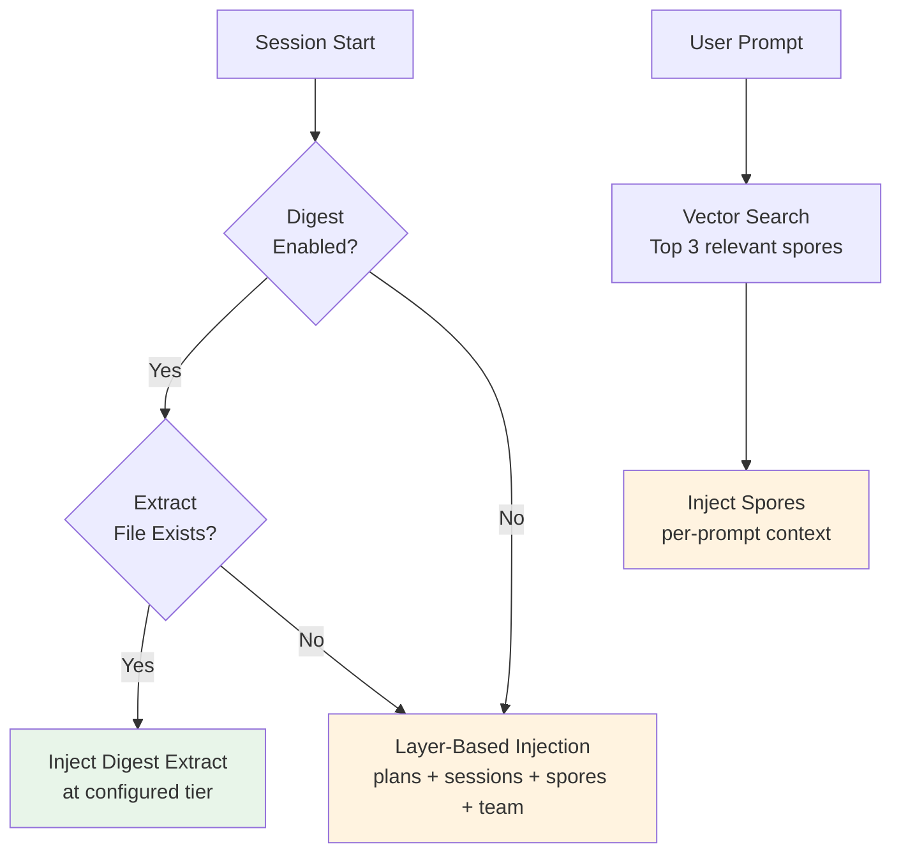
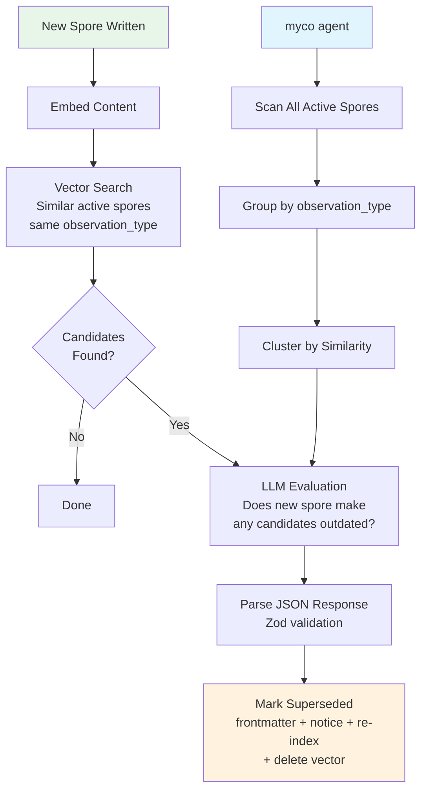
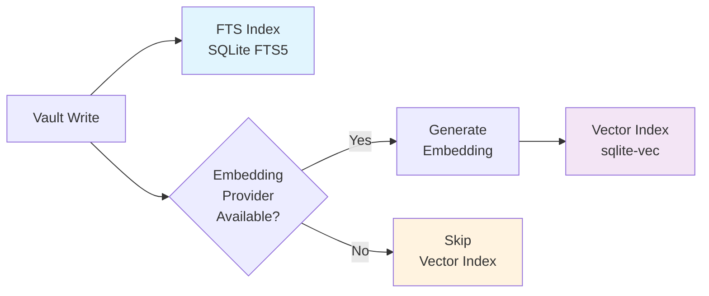
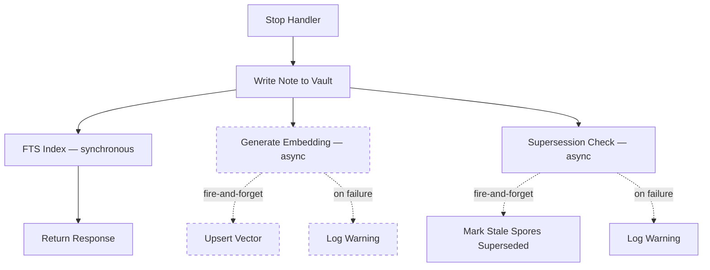
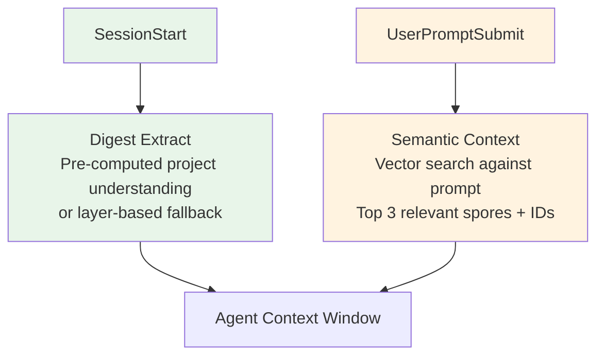
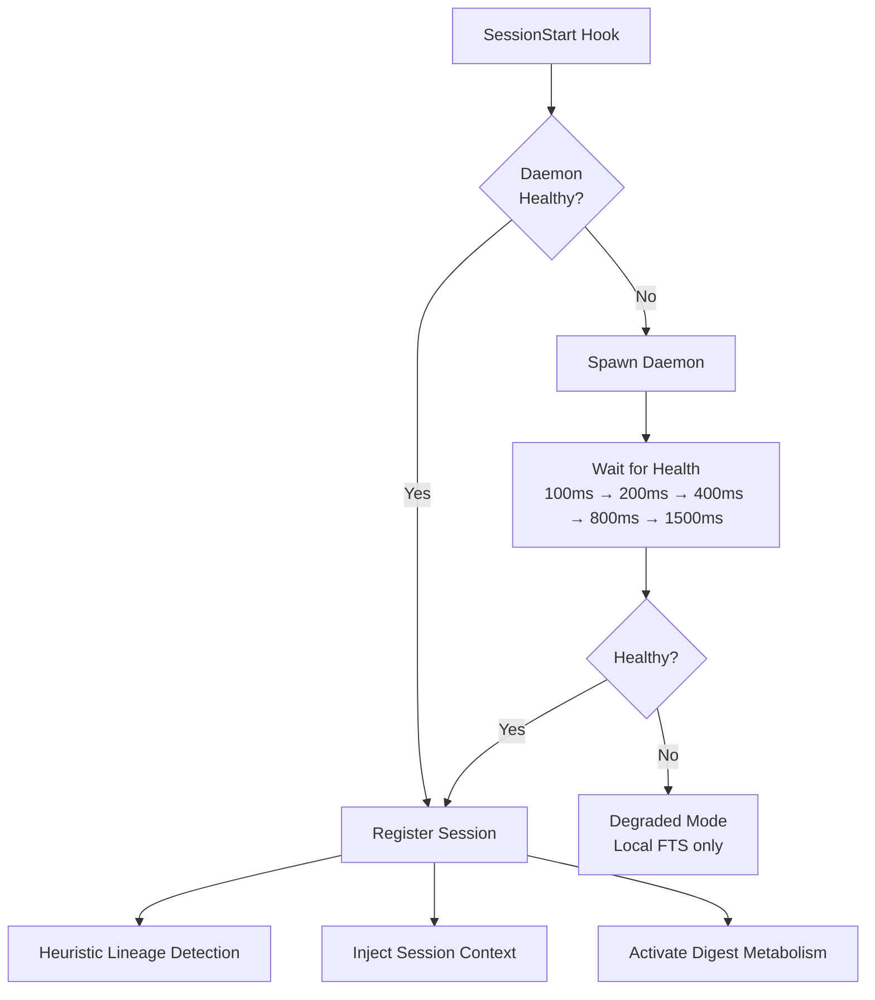
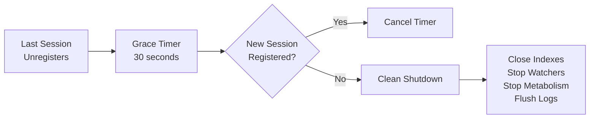

# Daemon Lifecycle

Myco runs a long-lived background daemon that processes session events, extracts observations (spores), maintains the vault index, and continuously synthesizes knowledge into digest extracts. The daemon is fully automatic — users never start, stop, or restart it manually.

## Session Flow


## Digest System

The digest engine runs continuously inside the daemon, synthesizing accumulated vault knowledge into tiered context extracts. These pre-computed summaries are served instantly at session start — no LLM call needed at read time.



Substrate discovery filters out superseded and archived spores — only active observations feed into the synthesis. Individual tier failures are caught and don't abort the cycle; the timestamp advances regardless so the same substrate isn't rediscovered.

### Metabolism States

The digest engine adapts its processing rate based on activity:

| State | Interval | Trigger |
|-------|----------|---------|
| **Active** | 5 minutes | Substrate found, or session registered |
| **Cooling** | 15m → 30m → 1h | Empty cycles (no new substrate) |
| **Dormant** | Suspended | No substrate for 2+ hours |

New session registrations activate the metabolism from any state.

### Tiered Extracts

Each tier serves a different use case and gets its own purpose-built prompt:

| Tier | Character | Use Case |
|------|-----------|----------|
| **1,500** | Executive briefing | Quick orientation — what is this, what's active, what to avoid |
| **3,000** | Team standup | Enough to start contributing — decisions, plans, conventions |
| **5,000** | Deep onboarding | Full context — trade-offs, patterns, team dynamics |
| **10,000** | Institutional knowledge | Everything — thread history, design tensions, lessons learned |

### Context Injection with Digest

When digest is enabled, the session-start hook serves the pre-computed extract instead of the layer-based system:



Per-prompt spore injection continues unchanged alongside digest — the extract provides the big picture, spore injection provides targeted relevance for each specific prompt.

## Vault Intelligence

As projects evolve, older spores become stale. The intelligence pipeline automatically detects and supersedes outdated observations.



**Inline (automatic)** — after every spore write (daemon batch processor and MCP `myco_remember`), a fire-and-forget supersession check runs. Sequential within a batch to avoid overwhelming the LLM.

**CLI (manual)** — `myco agent` runs the intelligence agent to scan active spores, cluster by similarity within each observation type, and determine which are outdated. Use `--dry-run` to preview. Useful for catch-up after refactors or initial vault cleanup.

Superseded spores are preserved with lineage metadata (`superseded_by` frontmatter + Obsidian wikilink) — never deleted. They are filtered from search results, recall, and digest substrate.

## Graph Architecture

The knowledge graph uses a two-layer model stored in the `graph_edges` table:

**Lineage layer** (automatic, no LLM):
- `FROM_SESSION` — spore → session (created on spore insert)
- `EXTRACTED_FROM` — spore → batch (created on spore insert)
- `HAS_BATCH` — session → batch (created on batch insert)
- `DERIVED_FROM` — wisdom spore → source spore (created on consolidation)

**Intelligence layer** (agent-created, LLM-driven):
- `RELATES_TO` — semantic relationship between spores or entities
- `SUPERSEDED_BY` — newer observation replaces older one
- `REFERENCES` — spore references an entity
- `DEPENDS_ON` — architectural dependency between entities
- `AFFECTS` — observation impacts a component

Node types: `session`, `batch`, `spore`, `entity`. Unlike the old `edges` table, `graph_edges` has no FK constraints on source/target — any node can connect to any other.

### Consolidation

When the intelligence agent finds 3+ semantically similar spores, it synthesizes them into a **wisdom** spore:

1. Wisdom spore created with `observation_type: 'wisdom'` and `properties.consolidated_from` listing source IDs
2. `DERIVED_FROM` lineage edges auto-created from wisdom to each source
3. Source spores resolved with action `consolidate` (status → 'consolidated')
4. Consolidated spores excluded from future consolidation to prevent wisdom-of-wisdom

### Entity Types

Three types only (tightened from the original seven):
- **component** — module, class, service, or significant function
- **concept** — architectural pattern or domain concept spanning 2+ sessions
- **person** — contributor or team member

Entities are created only when referenced by 3+ spores from 2+ sessions. Old types (file, bug, decision, tool) are archived on startup.

### Session Summary Triggers

Summaries are event-driven, not dependent on full agent runs:
- **On session stop**: fire-and-forget title-summary agent task
- **On batch threshold**: triggered every N batches (configurable via `agent.summary_batch_interval`)

## Indexing & Embedding Pipeline

Every vault write goes through a two-stage indexing process: FTS for keyword search, vector embeddings for semantic search.



### What Gets Indexed and Embedded

| Content | When | FTS Indexed | Embedded | Vector ID |
|---------|------|-------------|----------|-----------|
| Session notes | Stop handler | indexAndEmbed | fire-and-forget | `session-{id}` |
| Spores (daemon) | Stop handler | indexAndEmbed | fire-and-forget | `{type}-{session}-{ts}` |
| Spores (MCP `myco_remember`) | On tool call | indexNote | embedNote | `{type}-{hex}` |
| Artifacts | Stop handler | indexAndEmbed | fire-and-forget | `{slugified-path}` |
| Plans (file watcher) | Real-time | indexAndEmbed | fire-and-forget | `plan-{filename}` |
| Wisdom notes (`myco_consolidate`) | On tool call | indexNote | embedNote | `{type}-wisdom-{hex}` |
| Superseded spores | On supersede | updated | embedding deleted | — |

### Embedding and Intelligence are Fire-and-Forget

Embeddings and supersession checks are generated asynchronously and never block the response. If providers are unavailable, the note is still written and FTS-indexed — semantic search and intelligence degrade gracefully.



## Context Injection

Two injection points, each with a different purpose:



**Session start** — injected once, project understanding:
- Digest extract at the configured tier (when digest is enabled and extracts exist)
- Fallback: active plans, parent session summary, git branch, IDs as breadcrumbs
- Session ID and branch name always appended

**Per-prompt** — injected on every prompt, targeted intelligence:
- Vector similarity search against the prompt text (~20ms, no LLM)
- Top 3 spores, filtered for superseded/archived
- Each result includes the spore ID for follow-up
- Short prompts (<10 chars) skip the search

## Daemon Startup



The daemon initializes in this order:

1. Load config from `myco.yaml`
2. Create structured logger
3. Initialize LLM provider + embedding provider
4. Initialize vector index (test embedding for dimensions)
5. Initialize FTS index
6. Initialize lineage graph
7. Migrate flat spore files to type subdirectories (if needed)
8. Migrate `memories/` → `spores/` (if upgrading from older version)
9. Start plan file watcher
10. Initialize digest engine + metabolism (if enabled)
11. Start HTTP server
12. Write `daemon.json` with PID and port

## Shutdown

The daemon shuts itself down after a grace period with no active sessions:



The grace period prevents the daemon from cycling on/off during rapid session reloads (e.g., clearing context → new session within seconds).

## Degraded Mode

If the daemon is unreachable, hooks fall back gracefully:

| Hook | Degraded behavior |
|------|-------------------|
| `SessionStart` | Context injection via local FTS query (no digest, no semantic search) |
| `UserPromptSubmit` | Events buffered to disk (JSONL files), no context injection |
| `PostToolUse` | Events buffered to disk |
| `Stop` | Local LLM processing: session/spore writes (no embeddings, no lineage) |
| `SessionEnd` | No-op |

Buffered events are processed by the daemon when it next starts. Buffer files are cleaned up after 24 hours.

## After Plugin Updates

1. Old daemon continues running with old code until it shuts down
2. Next `SessionStart` hook spawns a new daemon from the updated `dist/` directory
3. New daemon picks up seamlessly — same vault, same indexes, same config

No manual restart needed. For development, use `make build && node dist/src/cli.js restart`.

## Configuration

```yaml
daemon:
  log_level: info          # debug | info | warn | error
  grace_period: 30         # seconds before shutdown after last session ends
  max_log_size: 5242880    # log rotation threshold (bytes)

capture:
  extraction_max_tokens: 2048    # spore extraction budget per batch
  summary_max_tokens: 1024       # session summary budget
  title_max_tokens: 32           # session title budget
  classification_max_tokens: 1024 # artifact classification budget

digest:
  enabled: true                          # opt-out (enabled by default)
  tiers: [1500, 3000, 5000, 10000]       # which tiers to generate
  inject_tier: 3000                      # auto-inject at session start
  intelligence:
    provider: null                       # null = inherit from main LLM
    model: null                          # null = inherit from main LLM
    context_window: 32768                # override for digest operations
    keep_alive: 30m                      # keep model loaded (Ollama)
    gpu_kv_cache: false                  # KV cache in RAM (LM Studio)
  metabolism:
    active_interval: 300                 # seconds between active cycles
    cooldown_intervals: [900, 1800, 3600] # backoff schedule (seconds)
    dormancy_threshold: 7200             # seconds before dormancy
  substrate:
    max_notes_per_cycle: 50              # cap substrate per cycle
```

## Monitoring

```bash
node dist/src/cli.js stats    # PID, port, active sessions, vault stats, digest status
node dist/src/cli.js logs     # Tail daemon + MCP activity logs
```

### Digest Management

```bash
node dist/src/cli.js digest              # Run an incremental digest cycle
node dist/src/cli.js digest --tier 3000  # Reprocess a specific tier (clean slate, all substrate)
node dist/src/cli.js digest --full       # Reprocess all tiers from scratch
```

### Vault Intelligence

```bash
node dist/src/cli.js agent              # Run the intelligence agent
node dist/src/cli.js agent --dry-run    # Preview what would be changed
```

Or via MCP:
```json
{ "tool": "myco_logs", "level": "info", "component": "digest" }
{ "tool": "myco_logs", "level": "info", "component": "intelligence" }
```

## Files

| File | Purpose |
|------|---------|
| `daemon.json` | Running daemon PID and port |
| `index.db` | SQLite FTS5 full-text search index |
| `vectors.db` | sqlite-vec vector embedding index |
| `lineage.json` | Session parent-child relationship graph |
| `logs/daemon.log` | Daemon structured logs (JSONL) |
| `logs/mcp.jsonl` | MCP tool activity log |
| `buffer/*.jsonl` | Per-session event buffers (ephemeral) |
| `attachments/*.png` | Images extracted from session transcripts (Obsidian embeds) |
| `digest/extract-*.md` | Pre-computed context extracts per tier |
| `digest/trace.jsonl` | Digest cycle audit trail |

## Transcript Sourcing

Session conversation turns are built from the agent's native transcript file — not from Myco's event buffer. The buffer only captures what hooks send (user prompts, tool uses) and has no AI responses.

The agent adapter registry (`src/agents/`) tries each adapter in priority order:

| Agent | Transcript Location | Format |
|-------|-------------------|--------|
| Claude Code | `~/.claude/projects/<project>/<session>.jsonl` | JSONL (`type` field) |
| Cursor (newer) | `~/.cursor/projects/<project>/agent-transcripts/<session>/<session>.jsonl` | JSONL (`role` field) |
| Cursor (older) | `~/.cursor/projects/<project>/agent-transcripts/<session>.txt` | Plain text (`user:`/`assistant:` markers) |
| Buffer fallback | `buffer/<session>.jsonl` | Myco's own event buffer (no AI responses) |

Images in transcripts are decoded and saved to `attachments/` as `{session-id}-t{turn}-{index}.{ext}`, then embedded in the session note with `![[filename]]`.
