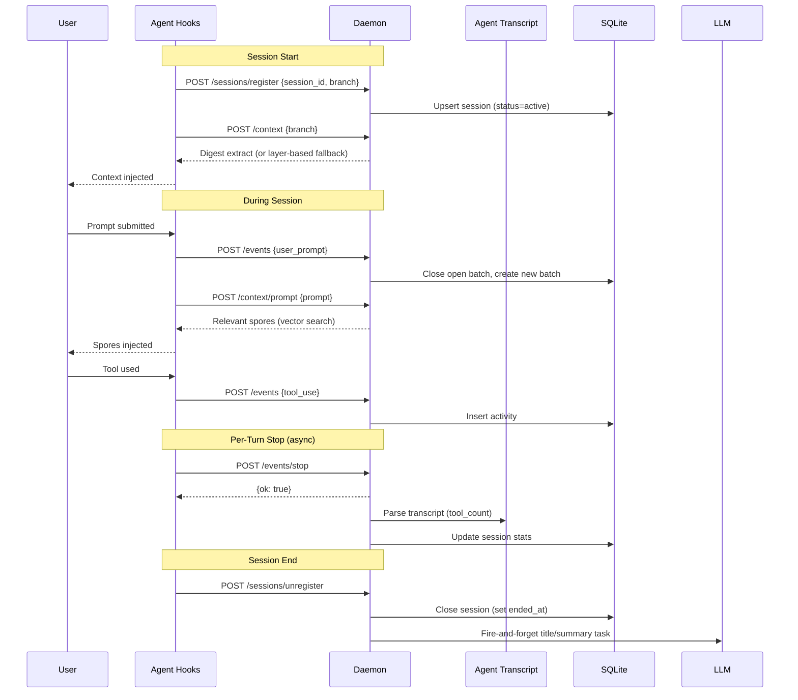
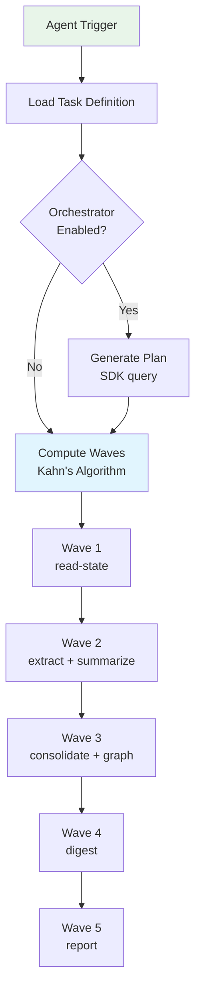
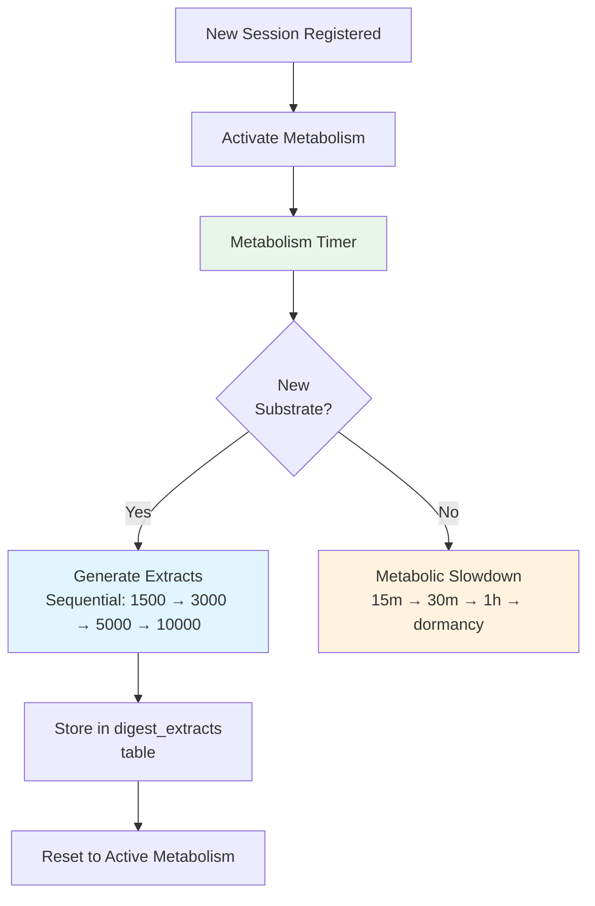
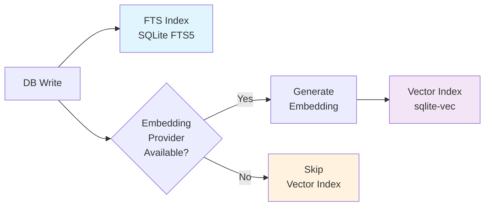
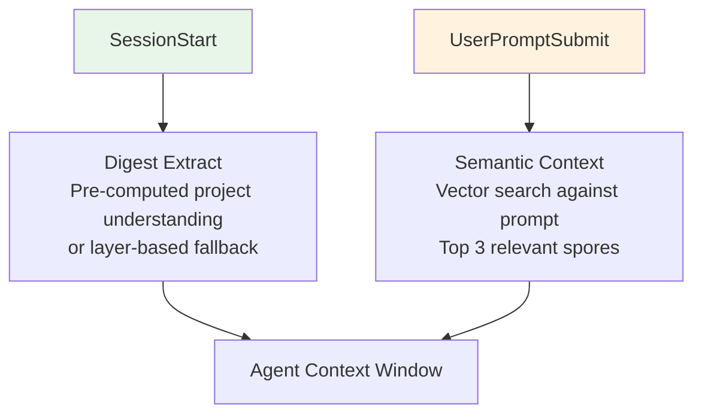
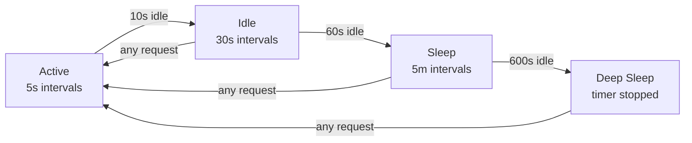
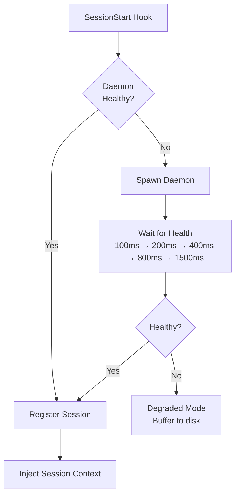
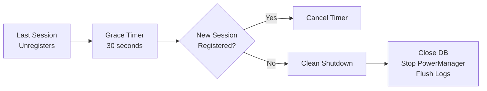

# Daemon Lifecycle

Myco runs a long-lived background daemon that processes session events, runs intelligence tasks, maintains the search index, and continuously synthesizes knowledge into digest extracts. The daemon is fully automatic — users never start, stop, or restart it manually.

## Session Flow



### Event Types

| Event | Hook | What happens |
|-------|------|-------------|
| `user_prompt` | UserPromptSubmit | Close open batch, create new batch in DB |
| `tool_use` | PostToolUse | Insert activity, increment batch activity_count |
| `tool_failure` | PostToolUseFailure | Insert activity with success=0 |
| `subagent_start` | SubagentStart | Record as activity |
| `subagent_stop` | SubagentStop | Record as activity |
| `pre_compact` | PreCompact | Record compaction event |
| `post_compact` | PostCompact | Record compaction event |
| `task_completed` | TaskCompleted | Record as activity |

### Batch Summary Triggers

Summaries are event-driven, triggered on configurable intervals:
- Every N batches (configurable via `agent.summary_batch_interval`, default 5)
- On session stop: fire-and-forget title-summary agent task
- Setting `summary_batch_interval: 0` disables interval-based triggers

## Intelligence Agent

The intelligence agent runs inside the daemon, processing captured data through configurable task phases. Tasks are defined as YAML files with a dependency graph of phases.

### Task Execution Model



Phases in the same wave run in parallel via `Promise.allSettled()`. Each phase gets:
- Scoped tools (only the tools listed in `phase.tools[]`)
- A turn budget (`phase.maxTurns`)
- Isolated provider environment (via SDK `env` option)
- Results from prior phases as context

### Provider Config Resolution

```
Agent definition (YAML)
  ↓ overridden by
Database agent row
  ↓ overridden by
Task YAML (built-in or user)
  ↓ overridden by
myco.yaml global (agent.provider / agent.model)
  ↓ overridden by
myco.yaml per-task (agent.tasks.<name>.provider)
  ↓ overridden by
myco.yaml per-phase (agent.tasks.<name>.phases.<phase>.provider)
```

### Built-in Tasks

| Task | Phases | Description |
|------|--------|-------------|
| `full-intelligence` | read-state → extract + summarize → consolidate + graph → digest → report | Complete pipeline |
| `title-summary` | Single phase | Generate/update session titles and summaries |
| `extract-only` | read-state → extract | Observation extraction only |
| `review-session` | Single phase | Deep review of a specific session |
| `supersession-sweep` | Single phase | Find and supersede stale spores |
| `digest-only` | Single phase | Regenerate digest extracts |
| `graph-maintenance` | Single phase | Entity and edge maintenance |

### Consolidation

When the intelligence agent finds 3+ semantically similar spores, it synthesizes them into a **wisdom** spore:

1. Wisdom spore created with `observation_type: 'wisdom'` and `properties.consolidated_from`
2. `DERIVED_FROM` graph edges auto-created from wisdom to each source
3. Source spores resolved with action `consolidate` (status → 'consolidated')
4. Consolidated spores excluded from future consolidation

## Digest System

The digest engine synthesizes accumulated knowledge into tiered context extracts. These pre-computed summaries are served instantly at session start.



### Metabolism States

| State | Interval | Trigger |
|-------|----------|---------|
| **Active** | 5 minutes | Substrate found, or session registered |
| **Cooling** | 15m → 30m → 1h | Empty cycles (no new substrate) |
| **Dormant** | Suspended | No substrate for 2+ hours |

### Tiered Extracts

| Tier | Character | Use Case |
|------|-----------|----------|
| **1,500** | Executive briefing | Quick orientation — what is this, what's active, what to avoid |
| **3,000** | Team standup | Enough to start contributing — decisions, plans, conventions |
| **5,000** | Deep onboarding | Full context — trade-offs, patterns, team dynamics |
| **10,000** | Institutional knowledge | Everything — thread history, design tensions, lessons learned |

## Graph Architecture

The knowledge graph uses a two-layer model stored in the `graph_edges` table:

**Lineage layer** (automatic, no LLM):
- `FROM_SESSION` — spore → session (created on spore insert)
- `EXTRACTED_FROM` — spore → batch (created on spore insert)
- `HAS_BATCH` — session → batch (created on batch insert)
- `DERIVED_FROM` — wisdom spore → source spore (created on consolidation)

**Intelligence layer** (agent-created, LLM-driven):
- `RELATES_TO` — semantic relationship between spores or entities
- `SUPERSEDED_BY` — newer observation replaces older one
- `REFERENCES` — spore references an entity
- `DEPENDS_ON` — architectural dependency between entities
- `AFFECTS` — observation impacts a component

Node types: `session`, `batch`, `spore`, `entity`.

### Entity Types

Three types:
- **component** — module, class, service, or significant function
- **concept** — architectural pattern or domain concept spanning 2+ sessions
- **person** — contributor or team member

Entities are created only when referenced by 3+ spores from 2+ sessions.

## Indexing & Embedding

Every database write can trigger a two-stage indexing process: FTS for keyword search, vector embeddings for semantic search.



### What Gets Indexed

| Content | When | Embedded |
|---------|------|----------|
| Sessions | On close | Yes (fire-and-forget) |
| Prompt batches | On close | FTS only |
| Spores | On insert | Yes (fire-and-forget) |
| Plans | On capture | Yes (fire-and-forget) |
| Artifacts | On capture | Yes (fire-and-forget) |

### Embedding Reconciliation

The `EmbeddingManager` runs periodic reconciliation via the PowerManager:
- **Embed missing** — find rows with `embedded=0`, generate and store vectors
- **Clean orphans** — remove vectors for deleted records
- **Reembed stale** — re-embed vectors from a previous model after provider change

Embeddings are always fire-and-forget — they never block the response. If providers are unavailable, records are still written and FTS-indexed. Semantic search degrades gracefully.

## Context Injection

Two injection points, each with a different purpose:



**Session start** — injected once, project understanding:
- Digest extract at the configured tier (when extracts exist)
- Fallback layers: active plans, recent sessions, relevant spores, team activity
- Total budget: ~1200 tokens
- Session ID and branch name always appended

**Per-prompt** — injected on every prompt, targeted intelligence:
- Vector similarity search against the prompt text
- Top 3 spores, filtered for superseded/archived
- Each result includes the spore ID for follow-up
- Short prompts (<10 chars) skip the search

## Power Management

The daemon adapts its background work rate based on activity:



| State | Job interval | Trigger to wake |
|-------|-------------|-----------------|
| **active** | 5 seconds | Any HTTP request |
| **idle** | 30 seconds | Any HTTP request |
| **sleep** | 5 minutes | Any HTTP request |
| **deep_sleep** | Stopped | Any HTTP request |

### Registered Jobs

| Job | States | Purpose |
|-----|--------|---------|
| `embedding-reconcile` | active, idle | Batch embed missing rows, clean orphans |
| `session-maintenance` | active, idle, sleep | Complete stale sessions, delete dead ones |
| `agent-auto-run` | active, idle | Run intelligence agent on unprocessed batches |

## Daemon Startup



The daemon initializes in this order:

1. Kill stale daemon (check `daemon.json` PID)
2. Load secrets from `secrets.env`
3. Load config from `myco.yaml`
4. Initialize SQLite database + schema (idempotent)
5. Initialize embedding system (vector store, provider, record source, manager)
6. Register built-in agents and tasks from YAML definitions
7. Clean stale agent runs (crash recovery)
8. Resolve UI directory (`dist/ui/`)
9. Create PowerManager (state machine for background jobs)
10. Create HTTP server
11. Create SessionRegistry
12. Create TranscriptMiner
13. Clean stale event buffers (>24h)
14. Reconcile buffered events from downtime
15. Register ~40+ API routes
16. Start server (evict existing daemon, resolve port)
17. Register power jobs (embedding, session maintenance, agent auto-run)
18. Start PowerManager tick loop
19. Write `daemon.json` with PID and port

## Shutdown

The daemon shuts itself down after a grace period with no active sessions:



## Degraded Mode

If the daemon is unreachable, hooks fall back gracefully:

| Hook | Degraded behavior |
|------|-------------------|
| `SessionStart` | Context injection via local DB query (no digest, no semantic search) |
| `UserPromptSubmit` | Events buffered to disk (JSONL files), no context injection |
| `PostToolUse` | Events buffered to disk |
| `Stop` | Buffered to disk, processed when daemon returns |
| `SessionEnd` | No-op |

Buffered events are reconciled by the daemon when it next starts. Buffer files are cleaned up after 24 hours.

## After Plugin Updates

1. Old daemon continues running with old code until it shuts down
2. Next `SessionStart` hook spawns a new daemon from the updated `dist/` directory
3. New daemon picks up seamlessly — same database, same indexes, same config

No manual restart needed. For development, use `make build && myco-dev restart`.

## Configuration

```yaml
version: 3
embedding:
  provider: ollama              # ollama | openai-compatible | openrouter | openai
  model: bge-m3                 # embedding model name
  base_url: http://...          # optional, for custom endpoints
daemon:
  port: null                    # null = auto-assign, persisted once resolved
  log_level: info               # debug | info | warn | error
capture:
  transcript_paths: []          # additional transcript search paths
  artifact_watch:               # directories to watch for plan files
    - .claude/plans/
    - .cursor/plans/
  artifact_extensions: [.md]
  buffer_max_events: 500
agent:
  auto_run: true                # daemon auto-triggers on unprocessed batches
  interval_seconds: 300         # seconds between auto-run checks
  summary_batch_interval: 5     # batches between title/summary triggers (0 = disable)
  provider:                     # global default provider
    type: cloud                 # cloud | ollama | lmstudio
    model: claude-sonnet-4-6    # optional model override
    context_length: 8192        # optional, for local models
  tasks:                        # per-task overrides
    title-summary:
      provider:
        type: ollama
        model: granite4:small-h
```

## Monitoring

```bash
myco stats          # PID, port, active sessions, database stats
myco doctor         # Health check: vault, DB, providers, agents, daemon
myco doctor --fix   # Auto-repair fixable issues
myco logs           # Tail daemon logs
```

## Database

All data lives in SQLite:

| Database | Contents |
|----------|----------|
| `myco.db` | Sessions, batches, activities, spores, entities, graph edges, agent runs/reports/turns, digest extracts, plans, artifacts, team, FTS indexes |
| `vectors.db` | sqlite-vec vector embeddings (1024-dim for bge-m3) |

Supporting files:

| File | Purpose |
|------|---------|
| `myco.yaml` | Vault configuration |
| `daemon.json` | Running daemon PID and port |
| `secrets.env` | API keys for cloud providers (gitignored) |
| `buffer/*.jsonl` | Per-session event buffers (ephemeral) |
| `attachments/*.png` | Images extracted from session transcripts |
| `logs/daemon.log` | Daemon structured logs (JSONL) |
| `tasks/*.yaml` | User-created agent task definitions |

## Transcript Sourcing

Session conversation turns are built from the agent's native transcript file — not from Myco's event buffer. The buffer only captures what hooks send (user prompts, tool uses) and has no AI responses.

The symbiont adapter registry tries each adapter in priority order:

| Agent | Transcript Location | Format |
|-------|-------------------|--------|
| Claude Code | `~/.claude/projects/<project>/<session>.jsonl` | JSONL (`type` field) |
| Cursor (newer) | `~/.cursor/projects/<project>/agent-transcripts/<session>/<session>.jsonl` | JSONL (`role` field) |
| Cursor (older) | `~/.cursor/projects/<project>/agent-transcripts/<session>.txt` | Plain text (`user:`/`assistant:` markers) |
| Buffer fallback | `buffer/<session>.jsonl` | Myco's own event buffer (no AI responses) |

Images in transcripts are decoded and saved to `attachments/` as `{session-id}-t{turn}-{index}.{ext}`.
