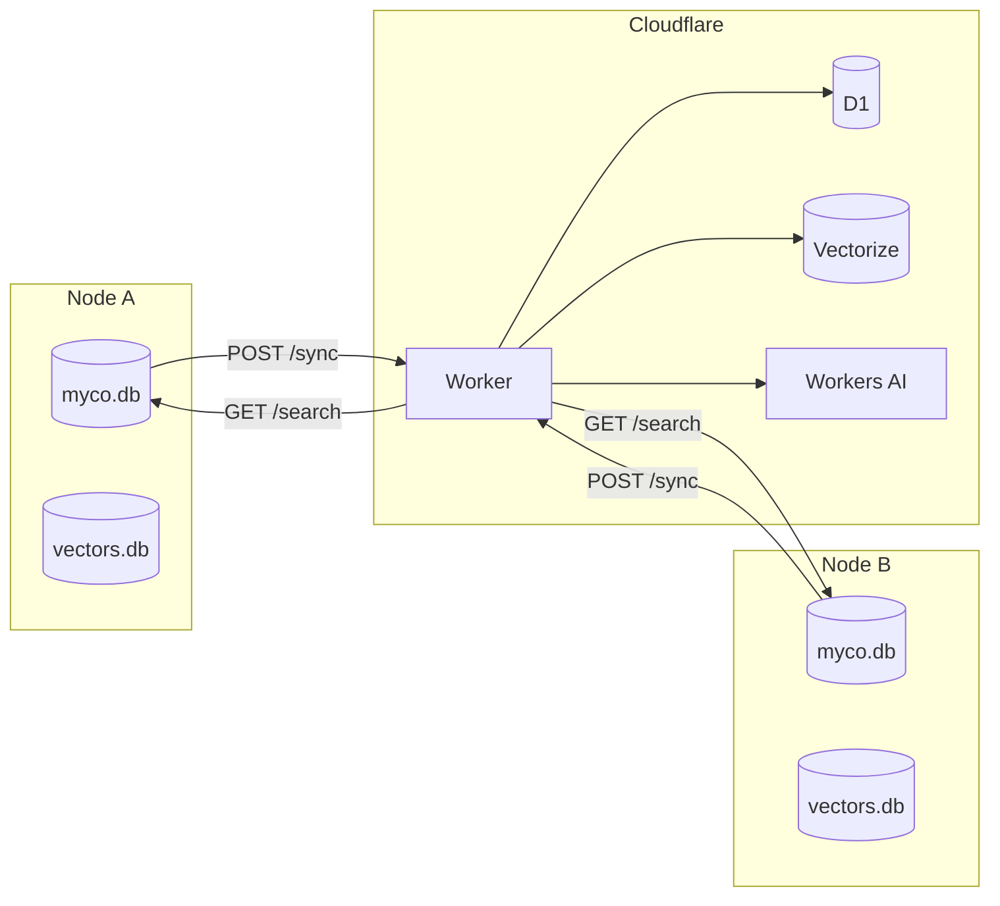

# Team Sync

Share captured knowledge across machines and team members through a Cloudflare-backed sync layer. Local databases remain the source of truth — the cloud store is a queryable mirror that all connected nodes push to and search.

## How it works

Each machine runs its own Myco daemon with a local SQLite database. When team sync is enabled, writes to knowledge tables (spores, sessions, plans, entities, graph edges) are enqueued in a local **outbox**. A background job pushes outbox batches to a thin **Cloudflare Worker**, which stores structured data in **D1** (SQLite) and embeddings in **Vectorize** (vector database).

When an agent searches for knowledge, Myco queries both the local database and the team Worker in parallel. Results are merged by relevance score and tagged with their source machine, so agents benefit from the entire team's accumulated intelligence.



## Quick start

### 1. Install Wrangler

The Cloudflare CLI is required for provisioning.

```bash
npm install -g wrangler
wrangler login
```

### 2. Create the team

One team member provisions the infrastructure. This creates a D1 database, a Vectorize index, and deploys the sync Worker.

```bash
myco team init
```

The command outputs a **Worker URL** and **API key**. Share these with teammates.

### 3. Connect teammates

Each teammate opens the **Team** page in their Myco dashboard (`http://localhost:<port>/team`), pastes the Worker URL and API key, and clicks **Connect**. Their node registers with the Worker and begins syncing immediately.

On first connect, all existing local knowledge is backfilled into the outbox and pushed to the team store in batches. New writes sync automatically going forward.

## What syncs

| Synced | Not synced |
|--------|------------|
| Spores (observations, wisdom) | Activities (tool call detail) |
| Sessions (metadata, title, summary) | Agent execution traces |
| Prompt batches (prompts, AI summaries) | Log entries |
| Entities and graph edges | Attachments (images) |
| Plans and artifacts | Buffer files |
| Resolution events | |
| Digest extracts | |

Prompt batches sync without individual tool call activities — teammates see what was asked and answered, not every file read or bash command.

## Machine identity

Every record is tagged with a **machine identity** — a deterministic `{github_username}_{machine_hash}` (e.g., `chris_a7b3c2`). This enables:

- Attributing knowledge to its source
- Filtering "my data" vs "team data" in search results
- Restoring backups from other machines without ID collisions

The identity is generated once and cached at `.myco/machine_id`. It uses the GitHub username (via `gh` CLI or `GITHUB_USER` env) and a SHA256 hash of the machine's hostname, OS username, and MAC address.

## Search fan-out

When team sync is enabled, search queries run against both local and cloud databases in parallel:

1. Local SQLite + sqlite-vec (semantic + FTS)
2. Worker `/search` endpoint (Workers AI embedding + Vectorize + D1 FTS)

Results merge into a single ranked list by similarity score. Since the cloud uses Workers AI `@cf/baai/bge-m3` (the same model recommended for local use), scores are directly comparable. Each result is tagged with its source:

- `source: "local"` — from this machine
- `source: "team:chris_a7b3c2"` — from the team store, attributed to a specific machine

If the Worker is slow or unreachable (strict 3-second timeout), local results return alone. Team search is additive, never blocking.

## Cloud embedding alternative

Since the team Worker uses Cloudflare Workers AI, team members who don't want to install Ollama locally can use Cloudflare's OpenAI-compatible embedding endpoint:

```yaml
# myco.yaml
embedding:
  provider: openai-compatible
  model: "@cf/baai/bge-m3"
  base_url: https://api.cloudflare.com/client/v4/accounts/{account_id}/ai/v1
```

Store the Cloudflare API token in `secrets.env`. This uses the same model as the Worker, producing compatible embeddings.

## Backup & restore

Independent of team sync, Myco creates local SQL dump backups for data resilience.

- **Automatic** — backups run during daemon idle periods via the PowerManager
- **Manual** — click "Backup Now" on the Operations page
- **Configurable directory** — set a custom backup path (network share, git repo) on the Operations page
- **Restore with preview** — dry-run shows what would be imported before executing
- **Content-hash deduplication** — restoring never overwrites existing records
- **Cross-machine restore** — restore a teammate's backup file; machine identity preserves attribution

Backups include all knowledge tables (sessions, spores, entities, plans, etc.) but exclude logs, tool call activities, and vector embeddings (rebuilt automatically after restore).

## Version awareness

Team members may run different Myco versions. A `sync_protocol_version` (integer) gates compatibility:

- The Worker stores a minimum and maximum supported protocol version
- Nodes include their protocol version in every sync payload
- Incompatible versions receive a clear error with upgrade instructions
- **Forward-compatible by default** — the Worker ignores unknown fields, so newer nodes can add data without breaking older Workers

The protocol version is decoupled from the npm package version. It only bumps on breaking changes to the sync wire format, which should be rare.

## Worker management

### Upgrade

Any team member with Wrangler access can update the Worker:

```bash
myco team upgrade
```

This redeploys the Worker with the current Myco version's bundled code.

### Architecture

The Worker is stateless — no WebSocket connections, no Durable Objects, no in-memory state. Each request reads from D1/Vectorize, processes, returns. Cloudflare handles scaling.

**Worker endpoints:**

| Method | Route | Purpose |
|--------|-------|---------|
| `GET` | `/health` | Connection status, node count (no auth required) |
| `POST` | `/connect` | Register a node, return team config |
| `POST` | `/sync` | Receive batch of records, write to D1 + Vectorize |
| `GET` | `/search` | Semantic + FTS search across team data |
| `GET` | `/config` | Return team configuration |
| `PUT` | `/config` | Update team configuration |

### Cloudflare free tier

A small team (2-5 developers) stays well within free tier limits:

| Service | Usage |
|---------|-------|
| Workers | Sync flushes + search queries |
| D1 | Batch writes, search reads |
| Vectorize | Embedding storage + similarity queries |
| Workers AI | Embedding on sync + search |

The $5/month paid tier provides significant headroom if needed.

## Dashboard

### Team page

- **Not connected** — setup instructions and connect form (Worker URL + API key)
- **Connected** — connection health, pending sync count, team credentials (copyable, with show/hide for the API key), machine identity, and a "Sync All" button for backfilling historical data

### Operations page

- Backup directory configuration
- Backup Now button
- Backup history with restore preview
